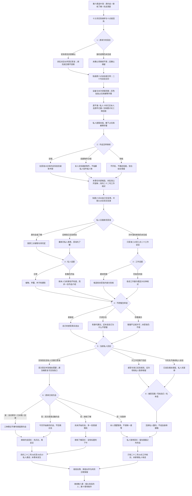

# 叶澄线第七章《请先问过我》分支结构

六月十九日至二十一日，76 个场景、15 个回流节点，12,913 个正文与选项字符，含所有平行分支。六次选择 **2×3×2×3×2×3＝216 种组合**，三种阶段回忆，非最终结局。唯一文本源为 `chapter-seven-ye.js`，章节标识 `ye7`。

空镜、自画分镜、候选待核不承担恋爱门槛。拒绝私人镜头、不给影片提供一个替代方案、不牵手或回家均可保留约会。旧播放单、本人的十秒、原信、人物影像与其他伙伴的权限全部保留，本章没有公开放映。

原约会继续不重复起算；旧修改后重新获准私人见面先进入了解，最后双方答应才开始新约会。本章没有确认女朋友、排他或公开关系。欠叶澄的修改未完成者只有工作谈话，新的一句好话不绕过旧欠项。其他伙伴待办也不因恋爱对象改变而被清除。

三种记录：`y7_open`、`y7_slow`、`y7_distance`。下一章工作核对与获准者的私人电话分别约定，均未提前记守约。读档按真实决策恢复，回到第四章会丢弃后续叶澄状态。无相机立绘按场景使用，原持相机版本保留。

阅读版见《叶澄线_第七章_请先问过我》，验证见《叶澄线_第七章_验证记录》，后续场景计划见《叶澄线_四章路线场景表》。
