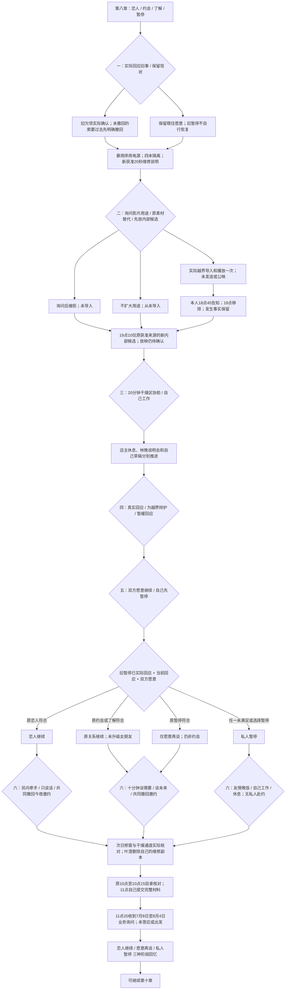

# 叶澄线第九章《有些片刻不需要证据》分支结构

已实装：63个场景、11个回流节点，六次选择共2×3×2×3×2×3＝216种组合；三种阶段回忆，尚非最终结局。原第八章末存档可直接继续。全部节点与正文共用 chapter-nine-ye.js。

## 阅读总览

影片用途与私人关系独立；帮助量、影片替代、今晚休息和不牵手不改变符合条件的双方答复。维修片段为本章新获准来源，区别于第三章知夏私人十秒和第八章共同照片，两者均不导入、不公开。越界路径后来删除不抹掉已发生事实，也不记当事人原谅。叶澄只删除自己的副本，不声称所有参与者副本都已消失。

## 完整场景图

全部63个场景和11个回流节点如下；差分段落在相同场景内显示。

```mermaid
flowchart TD
 y9_morning["Y9-01 · 雨伞没有装进箱子"]
 y9_entry_couple["女朋友也有不看手机的上午"]
 y9_entry_dates["原约会继续，不重复起算"]
 y9_entry_learning["继续了解，也能有普通的小事"]
 y9_entry_paused["工作群不能替私人聊天开门"]
 y9_prior_choice["选择一 · 今天怎样回应旧问题"]
 y9_repair_lin["新版本真的核过，才是今天的确认"]
 y9_repair_xu["新版本真的核过，才是今天的确认"]
 y9_repair_zhou["新版本真的核过，才是今天的确认"]
 y9_repair_ye["新版本真的核过，才是今天的确认"]
 y9_demand_withdraw["没有收回的话，今天自己说"]
 y9_prior_current["有些不确定，不再交给她猜"]
 y9_prior_hold["仍未准备好，就按真实状态说"]
 y9_hold_open["已有的愿意，不被另一份待办抹掉"]
 y9_hold_closed["原暂停还没有新的同意"]
 y9_deadline["Y9-02 · 自己的文件，不能只写成一个人名"]
 y9_rain["雨从后窗进来，先不急着找画面"]
 y9_damage["四本湿了，就单独记四本"]
 y9_stock_56["现有干燥可用的数量"]
 y9_stock_36["现有干燥可用的数量"]
 y9_repair_clip["Y9-03 · 只作维修说明的二十秒"]
 y9_candidate["她看见一个结尾，也看见不属于影片的用途"]
 y9_film_choice["选择二 · 这个结尾怎样处理"]
 y9_film_ask["问过以后，真正听见不愿意"]
 y9_film_replace["不索取另一种更好看的私话"]
 y9_film_safe["没有进过影片，就不补一份删除记录"]
 y9_film_use["叶澄自己按下了导入，也不能把责任转给意见"]
 y9_use_disclose["本人告知的不是假设，而是已经发生的事"]
 y9_use_remove["移除能停止继续使用，不能抹掉发生过"]
 y9_plan["今天的替代候选，由她自己完成"]
 y9_owner_rest["七点半，店主真正去休息"]
 y9_help_choice["选择三 · 自己能留下的工时"]
 y9_help_finite["帮助有自己的数量，不接成整晚"]
 y9_help_own["自己的那一页，也需要真正回去"]
 y9_own_work["先做一轮自己的说明，再发真实回复"]
 y9_response_choice["选择四 · 我也需要回答的部分"]
 y9_response_used["自己的越界意见，也由自己承担"]
 y9_response_safe["不要求一个漂亮结尾替她们说话"]
 y9_response_kept["回应实际收到，旧问题仍按旧记录"]
 y9_response_defend["感动不是替当事人答应的理由"]
 y9_response_defer["今晚还不能说清，不让她继续猜"]
 y9_mutual_choice["选择五 · 今晚是否继续谈私人需要"]
 y9_relation_couple["继续做女朋友，不等于所有事情已经不难过"]
 y9_relation_dates["原约会继续，称呼不偷偷增加"]
 y9_relation_learning["继续了解，也听见新的愿意"]
 y9_relation_reopen["暂停之后，只到愿意再谈"]
 y9_relation_paused["合作继续，私人今天停在这里"]
 y9_close_couple["选择六 · 站台边，也可以只休息"]
 y9_station_hand["伸出的手，也在新的回答之后"]
 y9_station_talk["不牵手，也没有少一句继续"]
 y9_close_reopen["选择六 · 获准的十分钟不承担新称呼"]
 y9_station_needs["十分钟，能说出自己的那一份"]
 y9_station_future["下一次的时间，不是今天顺手填进去"]
 y9_contact_rest["实际说今晚不去，就不补一个赴约"]
 y9_close_paused["选择六 · 没有新邀约的自己的晚上"]
 y9_paused_self["自己的安排实际做过，不借她的行程绕过去"]
 y9_night_friend["友情、关灯和明天，都有自己的栏"]
 y9_window["Y9-04 · 修过的窗，不替所有设备签安全"]
 y9_maintenance_delete["自己的维修副本真实删掉，其他人的不代写"]
 y9_work_check["十点，原十五分钟工作核对实际开始"]
 y9_publisher["十一点，材料从自己的邮箱发出"]
 y9_business["她自己的下一份工作，仍由她自己答"]
 y9_noon["Y9-05 · 有些片刻不需要证据"]
 y9_entry_gate{"relationshipStatus"}
 y9_pending_gate{"pendingOmittedConversation"}
 y9_person_gate{"omittedPerson"}
 y9_demand_gate{"y8AllHistoryDemanded"}
 y9_withdrawn_gate{"y8DemandWithdrawn"}
 y9_hold_gate{"y9EntryStatus"}
 y9_stock_gate{"workflow"}
 y9_answer_use_gate{"y9UnauthorizedFilmUseOccurred"}
 y9_prior_ready_gate{"y9PriorReady"}
 y9_current_ready_gate{"y9CurrentResponseKept"}
 y9_relationship_gate{"y9EntryStatus"}
 ye_nine_complete["三种阶段回忆；可继续第十章"]
 y9_morning --> y9_entry_gate
 y9_entry_couple --> y9_prior_choice
 y9_entry_dates --> y9_prior_choice
 y9_entry_learning --> y9_prior_choice
 y9_entry_paused --> y9_prior_choice
 y9_prior_choice -->|"1. 实际完成旧修改，收回仍未撤回的要求，说清今天能给的回应。"| y9_pending_gate
 y9_prior_choice -->|"2. 准时承认仍需要时间，保留原工作范围与当前私人答复。"| y9_prior_hold
 y9_repair_lin --> y9_demand_gate
 y9_repair_xu --> y9_demand_gate
 y9_repair_zhou --> y9_demand_gate
 y9_repair_ye --> y9_demand_gate
 y9_demand_withdraw --> y9_prior_current
 y9_prior_current --> y9_deadline
 y9_prior_hold --> y9_hold_gate
 y9_hold_open --> y9_deadline
 y9_hold_closed --> y9_deadline
 y9_deadline --> y9_rain
 y9_rain --> y9_damage
 y9_damage --> y9_stock_gate
 y9_stock_56 --> y9_repair_clip
 y9_stock_36 --> y9_repair_clip
 y9_repair_clip --> y9_candidate
 y9_candidate --> y9_film_choice
 y9_film_choice -->|"1. 建议她分别问原当事人，等真实答复，不先导入影片。"| y9_film_ask
 y9_film_choice -->|"2. 建议直接用原获准空镜或自画物件与留白，不借这段私话。"| y9_film_replace
 y9_film_choice -->|"3. 劝她先放进内部影片候选，觉得感动就能让以后用途好商量。"| y9_film_use
 y9_film_ask --> y9_film_safe
 y9_film_replace --> y9_film_safe
 y9_film_safe --> y9_plan
 y9_film_use --> y9_use_disclose
 y9_use_disclose --> y9_use_remove
 y9_use_remove --> y9_plan
 y9_plan --> y9_owner_rest
 y9_owner_rest --> y9_help_choice
 y9_help_choice -->|"1. 另问二十分钟，搬三把干椅子并记新动线，到点结束。"| y9_help_finite
 y9_help_choice -->|"2. 核完自己原交付清单，按时回去写材料；其他工作由已答应的伙伴承担。"| y9_help_own
 y9_help_finite --> y9_own_work
 y9_help_own --> y9_own_work
 y9_own_work --> y9_response_choice
 y9_response_choice -->|"1. 回应实际发生的事，尊重当事人的拒绝，也说清自己的感受。"| y9_answer_use_gate
 y9_response_choice -->|"2. 坚持作品足够感动，觉得当事人应该更体谅这个结尾。"| y9_response_defend
 y9_response_choice -->|"3. 承认今晚还不能回应，先暂停私人推进，工作范围保留。"| y9_response_defer
 y9_response_used --> y9_response_kept
 y9_response_safe --> y9_response_kept
 y9_response_kept --> y9_mutual_choice
 y9_response_defend --> y9_mutual_choice
 y9_response_defer --> y9_mutual_choice
 y9_mutual_choice -->|"1. 先按真实回应的范围问她，是否愿意继续相处或重新谈需要。"| y9_prior_ready_gate
 y9_mutual_choice -->|"2. 今天先暂停私人安排，保留工作与已经发生的相处。"| y9_relation_paused
 y9_relation_couple --> y9_close_couple
 y9_relation_dates --> y9_close_reopen
 y9_relation_learning --> y9_close_reopen
 y9_relation_reopen --> y9_close_reopen
 y9_relation_paused --> y9_close_paused
 y9_close_couple -->|"1. 按新约去站台，另问能否牵手，只待十五分钟。"| y9_station_hand
 y9_close_couple -->|"2. 按新约去站台，只聊天，不增加身体接触。"| y9_station_talk
 y9_close_couple -->|"3. 明确今晚先各自休息，不去站台，私人见面另问。"| y9_contact_rest
 y9_station_hand --> y9_night_friend
 y9_station_talk --> y9_night_friend
 y9_close_reopen -->|"1. 按新约去站台，只谈各自需要，不增加接触。"| y9_station_needs
 y9_close_reopen -->|"2. 按新约去站台，只谈下一次怎样另问时间。"| y9_station_future
 y9_close_reopen -->|"3. 明确今晚先休息，不去见面，之后的时间再问。"| y9_contact_rest
 y9_station_needs --> y9_night_friend
 y9_station_future --> y9_night_friend
 y9_contact_rest --> y9_night_friend
 y9_close_paused -->|"1. 和陆遥聊她的新住处，有限听朋友自己的下一站。"| y9_paused_self
 y9_close_paused -->|"2. 完成自己的材料核对后准时停，不加额外剪辑工作。"| y9_paused_self
 y9_close_paused -->|"3. 先喝水、休息，不一直刷她的消息。"| y9_paused_self
 y9_paused_self --> y9_night_friend
 y9_night_friend --> y9_window
 y9_window --> y9_maintenance_delete
 y9_maintenance_delete --> y9_work_check
 y9_work_check --> y9_publisher
 y9_publisher --> y9_business
 y9_business --> y9_noon
 y9_noon --> ye_nine_complete
 y9_entry_gate -->|"girlfriends"| y9_entry_couple
 y9_entry_gate -->|"tryingDates"| y9_entry_dates
 y9_entry_gate -->|"gettingToKnow"| y9_entry_learning
 y9_entry_gate -->|"needsConversation"| y9_entry_paused
 y9_pending_gate -->|"true"| y9_person_gate
 y9_pending_gate -->|"false"| y9_demand_gate
 y9_person_gate -->|"lin"| y9_repair_lin
 y9_person_gate -->|"xu"| y9_repair_xu
 y9_person_gate -->|"zhou"| y9_repair_zhou
 y9_person_gate -->|"ye"| y9_repair_ye
 y9_demand_gate -->|"true"| y9_withdrawn_gate
 y9_demand_gate -->|"false"| y9_prior_current
 y9_withdrawn_gate -->|"true"| y9_prior_current
 y9_withdrawn_gate -->|"false"| y9_demand_withdraw
 y9_hold_gate -->|"girlfriends"| y9_hold_open
 y9_hold_gate -->|"tryingDates"| y9_hold_open
 y9_hold_gate -->|"gettingToKnow"| y9_hold_open
 y9_hold_gate -->|"needsConversation"| y9_hold_closed
 y9_stock_gate -->|"collective"| y9_stock_56
 y9_stock_gate -->|"solo"| y9_stock_56
 y9_stock_gate -->|"smaller"| y9_stock_36
 y9_answer_use_gate -->|"true"| y9_response_used
 y9_answer_use_gate -->|"false"| y9_response_safe
 y9_prior_ready_gate -->|"true"| y9_current_ready_gate
 y9_prior_ready_gate -->|"false"| y9_relation_paused
 y9_current_ready_gate -->|"true"| y9_relationship_gate
 y9_current_ready_gate -->|"false"| y9_relation_paused
 y9_relationship_gate -->|"girlfriends"| y9_relation_couple
 y9_relationship_gate -->|"tryingDates"| y9_relation_dates
 y9_relationship_gate -->|"gettingToKnow"| y9_relation_learning
 y9_relationship_gate -->|"needsConversation"| y9_relation_reopen
```

事实均在实际段落完成后记录；旧七八章标记冻结。新内部候选不是获准公映，设备没有重新通电，48元报价没有下单付款，原数量与二十四页保留。原第八章未提交完整材料的标记不倒改，本章11点才记实际提交。下一章职业答复期限为六月二十六日17点，本章只有业务询问。
