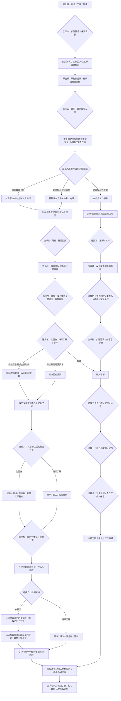

# 叶澄线第八章《镜头背后的人》分支结构

已实装：101 个场景、16 个回流节点，八次选择共 2×2×2×3×3×3×2×3＝1,296 种组合。共三种阶段回忆，尚非最终结局。原第七章末存档可直接继续，正文与此图均以 chapter-eight-ye.js 为源。

## 阅读总览

关系由原获准范围、真实回应与双方当次意愿决定。帮助量、不接触、不拍照片、不留宿都不改变已经得到的关系答复。原暂停者仅工作方向的三个回答不会变成恋人选项；工作澄清仍保留暂停。要求全部过去未被实际收回时不推进关系。旧私人十秒、原公开标记、预算、印数、二十四页与七章已发生的事实保留。

## 完整场景图

下面保留全部 101 个场景和 16 个回流节点，选项边注明序号；差分段落在同一场景内按条件显示。

```mermaid
flowchart TD
  y8_morning["Y8-01 · 今天还有一只没洗的碗"]
  y8_entry_open["原来的六点，先真正留出来"]
  y8_entry_slow["还没有称呼，也有两个人答应的时间"]
  y8_entry_distance["暂停的早晨，没有一通默认存在的电话"]
  y8_repair_choice["选择一 · 中午要交出的回应"]
  y8_arrival["Y8-02 · 箱子和目录各有一张回执"]
  y8_quantity_60["实收的原数量"]
  y8_quantity_40["实收的原数量"]
  y8_candidate_empty["空镜能够自己说话"]
  y8_candidate_drawing["不借别人的过去，也能画新的结尾"]
  y8_candidate_new["待核的地方，今天真正有了新版本"]
  y8_directory_done["十点二十，按原约结束"]
  y8_sample_choice["选择二 · 原三本样本怎样分工"]
  y8_sample_shared["纸页翻过，才写下看过"]
  y8_sample_separate["原分工也有真正完成的名字"]
  y8_sample_done["自己的稿，也从真正打开开始"]
  y8_repair_lin["旧欠项的新回复，今天才收到"]
  y8_repair_xu["旧欠项的新回复，今天才收到"]
  y8_repair_zhou["旧欠项的新回复，今天才收到"]
  y8_repair_ye["旧欠项的新回复，今天才收到"]
  y8_repair_current["这次不把感受缩成一条目录备注"]
  y8_repair_hold["没有完成的新回应，也准时说"]
  y8_hold_private["原有的愿意，不重复起算"]
  y8_hold_pause["旧暂停保留，回复工作不越过它"]
  y8_contact_original["原十八点十分钟，不悄悄往后加长"]
  y8_contact_new["暂停后的新邀请，真正得到新答复"]
  y8_work_schedule["六点只发目录进度，不假装她在等"]
  y8_own_work["自己的修改，自己实际发送"]
  y8_phone["Y8-03 · 六点，听见她把杯子放下来"]
  y8_work_message["没有私人电话的六点，只有实际发出的工作消息"]
  y8_evening["朋友的晚饭，不只是另一段关系的空档"]
  y8_meet_private["Y8-04 · 今天不拍，先不急着很会说话"]
  y8_meet_work["Y8-04 · 只答应了十五分钟，就在十五分钟里"]
  y8_topic_private["选择三 · 镜头放下以后，想听见什么"]
  y8_topic_work["选择三 · 今天获准的目录话题"]
  y8_story_waiting["灯亮着，不代表门马上会开"]
  y8_story_making["第一张很不清楚的照片，也有后来的人"]
  y8_story_common["被看见以后，也想自己发出声音"]
  y8_work_scope["来源核清，私人过去没有成为目录附件"]
  y8_work_capacity["十五分钟结束，不把剩下的都交给她"]
  y8_response_private["选择四 · 她已经说到这里，我怎样回答"]
  y8_response_work["选择四 · 工作话题的边缘"]
  y8_response_share["不需要一次讲完，也能听见现在"]
  y8_response_demand["她不交出的部分，也仍属于她"]
  y8_response_limited["自己没说顺，也不请她一个人继续"]
  y8_work_response_share["工作回复与真正结束"]
  y8_work_response_demand["工作回复与真正结束"]
  y8_work_response_limited["工作回复与真正结束"]
  y8_relation_private["选择五 · 今天不拍，关系由两个人说"]
  y8_demand_corrected["要求收回，是亲口做的一次回应"]
  y8_need_spoken["可以直接问今天，也能直接答今天"]
  y8_relation_together["今天才亲口成为女朋友"]
  y8_relation_slow["愿意继续，不急着替它填一个称呼"]
  y8_slow_date_status["原来的约会保留"]
  y8_slow_learn_status["新愿意从继续了解开始"]
  y8_relation_paused["喜欢听见了，也可以今天停下"]
  y8_relation_work["选择五 · 工作结束之后，自己的下一步"]
  y8_work_clarify["实际澄清收到，私人答复仍没有新增"]
  y8_work_keep_pause["没有发送的文字，仍只在自己的草稿里"]
  y8_work_paused["暂停没有被新的好话跳过"]
  y8_touch_together["选择六 · 身体靠近，再听一次双方愿意"]
  y8_touch_kiss["吻以前，先听见愿意"]
  y8_touch_hug["只到拥抱，也可以很高兴"]
  y8_touch_none["不接触，也没有少一个女朋友"]
  y8_touch_slow["选择六 · 继续相处的今天，也各自选节奏"]
  y8_slow_hand["牵手只回答牵手"]
  y8_slow_talk["没有称呼的笑，也没有被扣掉"]
  y8_slow_home["散步先结束，后面的邀请不偷接"]
  y8_touch_paused["选择六 · 暂停之后照顾自己的身体"]
  y8_paused_self["自己的这一小时，也有真正的去处"]
  y8_after_touch["拍不拍这一张，都不改变刚才的答案"]
  y8_photo_private["选择七 · 一张新的共同照片"]
  y8_photo_yes["这一张得到的答复，只到这一张"]
  y8_photo_no["没有照片，也没有少一段已经发生的下午"]
  y8_photo_paused["选择七 · 今天留下什么给自己"]
  y8_photo_self["自己的文字或留白，都不替别人留下"]
  y8_next_contact["明早的十分钟，今晚之后仍可重新问"]
  y8_night_together["选择八 · 晚饭与留下，各有自己的邀请"]
  y8_home_invite["第一次走进她没有镜头的生活"]
  y8_dinner["盐放早了，还能一起吃的晚饭"]
  y8_stay_invite["留下不是吃过晚饭后默认的一项"]
  y8_intimacy_yes["灯暗下来以前，也说清愿意"]
  y8_intimacy_hug["只拥抱和聊天，也是可以留下的夜晚"]
  y8_intimacy_none["不接触的留宿，也有完整的晚安"]
  y8_night_complete["这一夜真实过去，明早才是明早"]
  y8_breakfast["Y8-05 · 早饭没有特别的结尾词"]
  y8_dinner_leave["晚饭吃完，回去也仍是女朋友"]
  y8_night_home["不去住处，自己的晚上也完整"]
  y8_night_slow["选择八 · 继续了解的晚间安排"]
  y8_slow_noodles["多一碗面，不多一个默认的称呼"]
  y8_slow_walk["街口再走一点，是一次新的同意"]
  y8_slow_rest["还愿意了解，也可以先回去"]
  y8_slow_night_done["各自的床，和仍真实存在的明早"]
  y8_night_paused["选择八 · 自己的晚饭与晚安"]
  y8_paused_friend["朋友的话，也值得不用恋爱作开头"]
  y8_paused_work["待办核清，不用忙到看不见自己"]
  y8_paused_rest["没有完成关系，也可以先吃热的"]
  y8_paused_night_done["暂停的次日，也有真正继续的工作"]
  y8_morning_phone["Y8-06 · 九点半，认真回答昨晚之后"]
  y8_morning_after["电话真正结束之后，才记回应过"]
  y8_close["Y8-07 · 镜头之外，仍有各自的一天"]
  y8_entry_gate{"y7Outcome"}
  y8_quantity_gate{"workflow"}
  y8_candidate_gate{"y7FilmChoice"}
  y8_repair_gate{"y8RepairChoice"}
  y8_old_pending_gate{"pendingOmittedConversation"}
  y8_old_person_gate{"omittedPerson"}
  y8_hold_entry_gate{"y8EntryOutcome"}
  y8_contact_entry_gate{"y8OriginalContactBooked"}
  y8_phone_gate{"y8PrivateContactBooked"}
  y8_meeting_gate{"y8NextMeetingAccepted"}
  y8_correct_gate{"y8AllHistoryDemanded"}
  y8_relation_answer_gate{"y8RelationChoice"}
  y8_slow_status_gate{"y8EntryOutcome"}
  y8_night_gate{"y8Outcome"}
  y8_stay_gate{"y8NightChoice"}
  y8_intimacy_gate{"y8TouchChoice"}
  ye_eight_complete["第八章三种阶段回忆；可继续第九章"]
  y8_morning --> y8_entry_gate
  y8_entry_open --> y8_repair_choice
  y8_entry_slow --> y8_repair_choice
  y8_entry_distance --> y8_repair_choice
  y8_repair_choice -->|"1. 中午实际完成待确认的修改，也说清自己的感受和能给的时间。"| y8_arrival
  y8_repair_choice -->|"2. 准时说明还没准备好，保留已确认范围和当前私人状态。"| y8_arrival
  y8_arrival --> y8_quantity_gate
  y8_quantity_60 --> y8_candidate_gate
  y8_quantity_40 --> y8_candidate_gate
  y8_candidate_empty --> y8_directory_done
  y8_candidate_drawing --> y8_directory_done
  y8_candidate_new --> y8_directory_done
  y8_directory_done --> y8_sample_choice
  y8_sample_choice -->|"1. 我核三本页序与原句，见微查装订，十点四十去改稿。"| y8_sample_shared
  y8_sample_choice -->|"2. 我核交付清单，林晚与见微查原三本，之后各做自己的工作。"| y8_sample_separate
  y8_sample_shared --> y8_sample_done
  y8_sample_separate --> y8_sample_done
  y8_sample_done --> y8_repair_gate
  y8_repair_lin --> y8_repair_current
  y8_repair_xu --> y8_repair_current
  y8_repair_zhou --> y8_repair_current
  y8_repair_ye --> y8_repair_current
  y8_repair_current --> y8_contact_entry_gate
  y8_repair_hold --> y8_hold_entry_gate
  y8_hold_private --> y8_contact_entry_gate
  y8_hold_pause --> y8_work_schedule
  y8_contact_original --> y8_own_work
  y8_contact_new --> y8_own_work
  y8_work_schedule --> y8_own_work
  y8_own_work --> y8_phone_gate
  y8_phone --> y8_evening
  y8_work_message --> y8_evening
  y8_evening --> y8_meeting_gate
  y8_meet_private --> y8_topic_private
  y8_meet_work --> y8_topic_work
  y8_topic_private -->|"1. 问她为什么总想留下图像，她愿意讲的部分就好。"| y8_story_waiting
  y8_topic_private -->|"2. 从第一次拍照聊起，听她现在还喜欢怎样的日常。"| y8_story_making
  y8_topic_work -->|"1. 逐项核候选来源与用途，没收到答复的留在待用栏。"| y8_work_scope
  y8_topic_work -->|"2. 核双方能给的工时，新增问题另约，不默认她接下。"| y8_work_capacity
  y8_story_waiting --> y8_story_common
  y8_story_making --> y8_story_common
  y8_story_common --> y8_response_private
  y8_work_scope --> y8_response_work
  y8_work_capacity --> y8_response_work
  y8_response_private -->|"1. 听她愿意讲的部分，也把自己会退开的时刻说出来。"| y8_response_share
  y8_response_private -->|"2. 要求看完整旧相册和全部经历，才肯相信她没有隐瞒。"| y8_response_demand
  y8_response_private -->|"3. 承认今天有些话还说不顺，先明确自己能谈的部分。"| y8_response_limited
  y8_response_work -->|"1. 只回应实际目录与双方工时，私事等本人愿意再谈。"| y8_work_response_share
  y8_response_work -->|"2. 要求她交完整私人相册，作为今后合作可信的证明。"| y8_work_response_demand
  y8_response_work -->|"3. 承认私人问题还没准备好，今天按工作范围结束。"| y8_work_response_limited
  y8_response_share --> y8_relation_private
  y8_response_demand --> y8_relation_private
  y8_response_limited --> y8_relation_private
  y8_work_response_share --> y8_relation_work
  y8_work_response_demand --> y8_relation_work
  y8_work_response_limited --> y8_relation_work
  y8_relation_private -->|"1. 尊重她不说的部分，讲清自己的需要，问她是否愿意成为排他的女朋友。"| y8_correct_gate
  y8_relation_private -->|"2. 尊重她不说的部分，说明还需要时间，问能否继续了解。"| y8_correct_gate
  y8_relation_private -->|"3. 今天先暂停私人推进，不用刚才的喜欢催出一个答案。"| y8_relation_paused
  y8_demand_corrected --> y8_need_spoken
  y8_need_spoken --> y8_relation_answer_gate
  y8_relation_together --> y8_touch_together
  y8_relation_slow --> y8_slow_status_gate
  y8_slow_date_status --> y8_touch_slow
  y8_slow_learn_status --> y8_touch_slow
  y8_relation_paused --> y8_touch_paused
  y8_relation_work -->|"1. 发实际范围澄清，明确收回任何相册要求，不追加私人邀约。"| y8_work_clarify
  y8_relation_work -->|"2. 写出自己的误解供后续回复，今天不发送私人请求。"| y8_work_keep_pause
  y8_relation_work -->|"3. 先休息，承认自己的回复仍待完成。"| y8_work_keep_pause
  y8_work_clarify --> y8_work_paused
  y8_work_keep_pause --> y8_work_paused
  y8_work_paused --> y8_touch_paused
  y8_touch_together -->|"1. 问她愿不愿意接吻，我也愿意再靠近。"| y8_touch_kiss
  y8_touch_together -->|"2. 先问能否拥抱，今天就到这里。"| y8_touch_hug
  y8_touch_together -->|"3. 今天不增加身体接触，只一起坐一会儿。"| y8_touch_none
  y8_touch_kiss --> y8_after_touch
  y8_touch_hug --> y8_after_touch
  y8_touch_none --> y8_after_touch
  y8_touch_slow -->|"1. 问她愿不愿意牵手，只走一小段。"| y8_slow_hand
  y8_touch_slow -->|"2. 不接触，坐下聊今天的小事。"| y8_slow_talk
  y8_touch_slow -->|"3. 今天先结束这段散步，后续时间另问。"| y8_slow_home
  y8_slow_hand --> y8_after_touch
  y8_slow_talk --> y8_after_touch
  y8_slow_home --> y8_after_touch
  y8_touch_paused -->|"1. 自己走一段，再按时吃饭。"| y8_paused_self
  y8_touch_paused -->|"2. 回宿舍坐一会儿，喝水，慢慢整理感受。"| y8_paused_self
  y8_touch_paused -->|"3. 先休息，不用继续刷她的消息。"| y8_paused_self
  y8_paused_self --> y8_photo_paused
  y8_after_touch --> y8_photo_private
  y8_photo_private -->|"1. 另问是否愿意用手机拍一张合照，只各自私存，不发给朋友或影片。"| y8_photo_yes
  y8_photo_private -->|"2. 今天不留合照，只记得真正讲过的话。"| y8_photo_no
  y8_photo_yes --> y8_next_contact
  y8_photo_no --> y8_next_contact
  y8_photo_paused -->|"1. 只写自己的感受，不拍她、不记她未讲的经历。"| y8_photo_self
  y8_photo_paused -->|"2. 今天暂不记录，先去吃饭。"| y8_photo_self
  y8_photo_self --> y8_night_paused
  y8_next_contact --> y8_night_gate
  y8_night_together -->|"1. 愿意去吃晚饭，再另问双方是否愿意留宿；亲密的节奏继续各自答。"| y8_home_invite
  y8_night_together -->|"2. 愿意去吃晚饭，吃完回宿舍，今晚不留宿。"| y8_home_invite
  y8_night_together -->|"3. 今天先回去休息，明早按约再聊，不去住处。"| y8_night_home
  y8_home_invite --> y8_dinner
  y8_dinner --> y8_stay_gate
  y8_stay_invite --> y8_intimacy_gate
  y8_intimacy_yes --> y8_night_complete
  y8_intimacy_hug --> y8_night_complete
  y8_intimacy_none --> y8_night_complete
  y8_night_complete --> y8_breakfast
  y8_breakfast --> y8_morning_phone
  y8_dinner_leave --> y8_morning_phone
  y8_night_home --> y8_morning_phone
  y8_night_slow -->|"1. 另问是否愿意去面馆吃晚饭，吃完各自回去。"| y8_slow_noodles
  y8_night_slow -->|"2. 另问是否愿意只在街口走一段，不去住处。"| y8_slow_walk
  y8_night_slow -->|"3. 今天先回去，明早按约用电话再聊。"| y8_slow_rest
  y8_slow_noodles --> y8_slow_night_done
  y8_slow_walk --> y8_slow_night_done
  y8_slow_rest --> y8_slow_night_done
  y8_slow_night_done --> y8_morning_phone
  y8_night_paused -->|"1. 和陆遥吃晚饭，听朋友自己的下一站。"| y8_paused_friend
  y8_night_paused -->|"2. 整理自己的修改与真实待办，完成后准时睡。"| y8_paused_work
  y8_night_paused -->|"3. 独自吃饭和休息，不把难过藏成额外工作。"| y8_paused_rest
  y8_paused_friend --> y8_paused_night_done
  y8_paused_work --> y8_paused_night_done
  y8_paused_rest --> y8_paused_night_done
  y8_paused_night_done --> y8_close
  y8_morning_phone --> y8_morning_after
  y8_morning_after --> y8_close
  y8_close --> ye_eight_complete
  y8_entry_gate -->|"open"| y8_entry_open
  y8_entry_gate -->|"slow"| y8_entry_slow
  y8_entry_gate -->|"distance"| y8_entry_distance
  y8_quantity_gate -->|"collective"| y8_quantity_60
  y8_quantity_gate -->|"solo"| y8_quantity_60
  y8_quantity_gate -->|"smaller"| y8_quantity_40
  y8_candidate_gate -->|"empty"| y8_candidate_empty
  y8_candidate_gate -->|"drawing"| y8_candidate_drawing
  y8_candidate_gate -->|"pending"| y8_candidate_new
  y8_repair_gate -->|"act"| y8_old_pending_gate
  y8_repair_gate -->|"hold"| y8_repair_hold
  y8_old_pending_gate -->|"true"| y8_old_person_gate
  y8_old_pending_gate -->|"false"| y8_repair_current
  y8_old_person_gate -->|"lin"| y8_repair_lin
  y8_old_person_gate -->|"xu"| y8_repair_xu
  y8_old_person_gate -->|"zhou"| y8_repair_zhou
  y8_old_person_gate -->|"ye"| y8_repair_ye
  y8_hold_entry_gate -->|"open"| y8_hold_private
  y8_hold_entry_gate -->|"slow"| y8_hold_private
  y8_hold_entry_gate -->|"distance"| y8_hold_pause
  y8_contact_entry_gate -->|"true"| y8_contact_original
  y8_contact_entry_gate -->|"false"| y8_contact_new
  y8_phone_gate -->|"true"| y8_phone
  y8_phone_gate -->|"false"| y8_work_message
  y8_meeting_gate -->|"true"| y8_meet_private
  y8_meeting_gate -->|"false"| y8_meet_work
  y8_correct_gate -->|"true"| y8_demand_corrected
  y8_correct_gate -->|"false"| y8_need_spoken
  y8_relation_answer_gate -->|"together"| y8_relation_together
  y8_relation_answer_gate -->|"slow"| y8_relation_slow
  y8_slow_status_gate -->|"open"| y8_slow_date_status
  y8_slow_status_gate -->|"slow"| y8_slow_learn_status
  y8_slow_status_gate -->|"distance"| y8_slow_learn_status
  y8_night_gate -->|"together"| y8_night_together
  y8_night_gate -->|"slow"| y8_night_slow
  y8_stay_gate -->|"stay"| y8_stay_invite
  y8_stay_gate -->|"dinner"| y8_dinner_leave
  y8_intimacy_gate -->|"kiss"| y8_intimacy_yes
  y8_intimacy_gate -->|"hug"| y8_intimacy_hug
  y8_intimacy_gate -->|"none"| y8_intimacy_none
```

次日通话、过夜、早餐、接触、照片和关系称呼只在实际场景完成后写入。二十五号10点至10点15工作核对尚未发生；二十五号完整材料尚未提交；影片候选不等于已获准放映，告别展也尚未举办。
