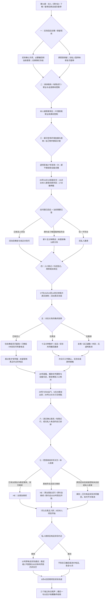

# 叶澄线第十章《没有镜头的约会》分支结构

已实装：83个场景、24个回流节点，七次选择2×3×2×2×3×2×2＝288种组合。原第九章末存档直接继续，独立标识ye10。三个最终结局必须读完各自秋日尾声才收藏。

## 阅读总览

职业由本人决定，影片、岗位、帮助、晚饭和留宿不决定恋爱结局。旧七八九章标记冻结；维修素材、知夏私人十秒和共同照片均不入影片，也不扩大原公开权限。原未拍过的空镜不补拍成过去发生，新环境选择在本章另问并真实拍摄。

## 完整场景图

全部83个场景与24个回流节点如下，平行对白在相同场景内按实际条件显示。

```mermaid
flowchart TD
 y10_start["Y10-01 · 发送以后，还有自己的下午"]
 y10_entry_couple["女朋友，不用占满全部等待"]
 y10_entry_dates["原约会，也要给未来具体的声音"]
 y10_entry_learning["杯子还歪，谈话可以慢一点"]
 y10_entry_paused["合作消息，不会直接成为邀约"]
 y10_prior_choice["选择一 · 最后一章，也不能省略旧事"]
 y10_repair_lin["实际确认 · 林晚"]
 y10_repair_xu["实际确认 · 许见微"]
 y10_repair_zhou["实际确认 · 周栀"]
 y10_repair_ye["实际确认 · 叶澄"]
 y10_demand_withdraw["把未撤回的索要，真正收回来"]
 y10_advice_withdraw["自己的坏建议，自己收回"]
 y10_prior_response["今天给出自己的感受，不重做昨夜"]
 y10_prior_hold["没有准备好，也讲清这次的范围"]
 y10_hold_open["已有的愿意，没有因放慢消失"]
 y10_hold_closed["原暂停不从一条工作消息打开"]
 y10_future_choice["选择二 · 四周以后，不用先承诺永远"]
 y10_future_concrete["想念可以说，条件也能具体"]
 y10_future_trial["一段有限的时间，也由两个人给"]
 y10_future_control["她拒绝交出决定权"]
 y10_job["自己的岗位，自己读过再回信"]
 y10_public_choice["选择三 · 真正能给告别展看的版本"]
 y10_public_environment["窗、柜台与切黑，各有明确来源"]
 y10_public_objects["自己画的杯子，也能和大家告别"]
 y10_projection["新的干燥设备，不替旧湿线复活"]
 y10_master["最后一份母版，真正交给现场"]
 y10_business["她自己核条件，自己按时答复"]
 y10_lu_boxes["两箱行李，不需要等电影来配乐"]
 y10_private_couple["女朋友晚上的时间，再自己问一次"]
 y10_private_talk["新的私人谈话，不先承担恋人称呼"]
 y10_private_closed["现在未获准，就不安排她来等"]
 y10_role_choice["选择四 · 告别展里自己承担的岗位"]
 y10_role_door["门口的五十分钟，给每个人一个入口"]
 y10_role_stock["归还也有位置，不急着给每本书定结尾"]
 y10_exhibit["Y10-02 · 来过的人，不只在片尾名单里"]
 y10_screening["四分钟，完成的是这一版作品"]
 y10_exhibit_wrap["散场，椅子与自己的时间也都归位"]
 y10_night_couple["选择五 · 放映以外，今晚想怎样相处"]
 y10_home_invite["先答应晚饭与进门"]
 y10_home_dinner["杯子不在镜头里，在桌上"]
 y10_stay_agree["留下与靠近，在新的愿意以后"]
 y10_overnight["一夜真正过去，才写留下"]
 y10_breakfast["早餐，先听今天的自己"]
 y10_dinner_part["只到晚饭，认真说晚安"]
 y10_couple_rest["休息，也有完整的一句愿意"]
 y10_couple_phone["原九点电话，真正用来讲早餐"]
 y10_night_talk["选择五 · 十五分钟，也可以明确不去"]
 y10_talk_walk["十五分钟的路，先走在今天"]
 y10_talk_work["她的项目，与我的第一条公交线"]
 y10_talk_rest["真正撤回这一晚，不虚构雨里的等待"]
 y10_night_closed["选择五 · 自己的今晚，不去她的路径等"]
 y10_closed_self["自己的时间也真实做过"]
 y10_talk_morning["九点工作确认，不补一份早餐同桌"]
 y10_packing["十一点，装箱和归还都真正完成"]
 y10_lu_dinner["朋友晚饭，先讲她自己的下一站"]
 y10_lu_entry["入口、证件与那一条原车次"]
 y10_lu_leave["七点五十，真正推门出发"]
 y10_lu_depart["九点二十，朋友真正向她的生活去"]
 y10_lights["Y10-03 · 灯关以后，钥匙也交回去"]
 y10_contact_open["选择六 · 未来电话，先让双方真的答应"]
 y10_contact_stable["两次二十分钟，不预填已经打过"]
 y10_contact_trial["先把这一通十分钟给出来"]
 y10_contact_closed["选择六 · 没有私人电话的下一份日程"]
 y10_contact_none["没约过的电话，不写成已经撤回"]
 y10_final_choice["选择七 · 两个人自己给最后的答复"]
 y10_he["HE答复 · 先愿意一起生活，再决定怎样记录"]
 y10_ne_couple["NE答复 · 女朋友也能有限试行"]
 y10_ne_dates["NE答复 · 原约会继续，不再起算一次"]
 y10_ne_new["NE答复 · 新约会，从双方真的答应开始"]
 y10_farewell["离别答复 · 不把一段缺口推给下一帧"]
 y10_cancel_calls["约过以后，告别时真正共同撤回"]
 y10_no_calls["本来没有新电话，告别也不补取消"]
 y10_july_job["Y10-04 · 七月一日，自己的第一天"]
 y10_project_depart["七月八日，她真正去做自己的项目"]
 y10_first_call["十号那一通，真正讲到饭和新路"]
 y10_second_change["十七号，先通知，才真正改约"]
 y10_second_call["二十一点，新的时间真正接通"]
 y10_trial_review["有限试行，先核这一通做到了什么"]
 y10_july_alone["同一个七月，也能分别过自己的日子"]
 y10_project_complete["八月四日，四周真的做完"]
 y10_he_autumn["秋日尾声 · 没有镜头的约会"]
 y10_ne_autumn["秋日尾声 · 下一帧见"]
 y10_farewell_autumn["秋日尾声 · 画面之外"]
 y10_entry_gate{"relationshipStatus"}
 y10_pending_gate{"pendingOmittedConversation"}
 y10_omitted_gate{"omittedPerson"}
 y10_demand_gate{"y8AllHistoryDemanded"}
 y10_demand_old_gate{"y8DemandWithdrawn"}
 y10_demand_ninth_gate{"y9OldDemandWithdrawn"}
 y10_advice_gate{"y9UnauthorizedFilmUseOccurred"}
 y10_advice_old_gate{"y9OwnBadAdviceWithdrawn"}
 y10_hold_ready_gate{"y9Outcome"}
 y10_private_ready_gate{"y10PriorReady"}
 y10_private_current_gate{"y10CurrentResponseKept"}
 y10_private_status_gate{"y10EntryStatus"}
 y10_night_gate{"y10PrivateMode"}
 y10_stay_gate{"y10NightChoice"}
 y10_contact_gate{"y10PrivateMode"}
 y10_contact_mode_gate{"y10FutureChoice"}
 y10_final_ready_gate{"y10PriorReady"}
 y10_final_current_gate{"y10CurrentResponseKept"}
 y10_final_status_gate{"y10EntryStatus"}
 y10_final_contact_gate{"y10ContactMode"}
 y10_cancel_gate{"y10CallsBooked"}
 y10_july_contact_gate{"y10Outcome"}
 y10_second_gate{"y10SecondCallBooked"}
 y10_autumn_gate{"y10Outcome"}
 ye_ten_complete["读完对应秋日才收藏：HE / NE / 离别"]
 y10_start --> y10_entry_gate
 y10_entry_couple --> y10_prior_choice
 y10_entry_dates --> y10_prior_choice
 y10_entry_learning --> y10_prior_choice
 y10_entry_paused --> y10_prior_choice
 y10_prior_choice -->|"1. 按原记录实际回应未完成的事，也说出自己现在的需要。"| y10_pending_gate
 y10_prior_choice -->|"2. 明确这次仍没有准备好，先保留现状，不借工作推进私人关系。"| y10_prior_hold
 y10_repair_lin --> y10_demand_gate
 y10_repair_xu --> y10_demand_gate
 y10_repair_zhou --> y10_demand_gate
 y10_repair_ye --> y10_demand_gate
 y10_demand_withdraw --> y10_advice_gate
 y10_advice_withdraw --> y10_prior_response
 y10_prior_response --> y10_future_choice
 y10_prior_hold --> y10_hold_ready_gate
 y10_hold_open --> y10_future_choice
 y10_hold_closed --> y10_future_choice
 y10_future_choice -->|"1. 具体说自己的想念，讨论能做到的联系量，职业与原始素材仍由本人决定。"| y10_future_concrete
 y10_future_choice -->|"2. 愿意先有限试行，只约一个真实能给的时段，再看后来的生活。"| y10_future_trial
 y10_future_choice -->|"3. 要求她不接外地工作，并交出全部原始素材来证明不会再有隐瞒。"| y10_future_control
 y10_future_concrete --> y10_job
 y10_future_trial --> y10_job
 y10_future_control --> y10_job
 y10_job --> y10_public_choice
 y10_public_choice -->|"1. 采用原环境空镜与黑画面，逐项取得这次现场放映答复。"| y10_public_environment
 y10_public_choice -->|"2. 采用叶澄自己的物件分镜，静音呈现，逐项取得现场放映答复。"| y10_public_objects
 y10_public_environment --> y10_projection
 y10_public_objects --> y10_projection
 y10_projection --> y10_master
 y10_master --> y10_business
 y10_business --> y10_lu_boxes
 y10_lu_boxes --> y10_private_ready_gate
 y10_private_couple --> y10_role_choice
 y10_private_talk --> y10_role_choice
 y10_private_closed --> y10_role_choice
 y10_role_choice -->|"1. 负责十四点至十四点五十的入口与领册登记，按数量交班。"| y10_role_door
 y10_role_choice -->|"2. 负责十四点至十四点五十的书桌与归还登记，按清单交班。"| y10_role_stock
 y10_role_door --> y10_exhibit
 y10_role_stock --> y10_exhibit
 y10_exhibit --> y10_screening
 y10_screening --> y10_exhibit_wrap
 y10_exhibit_wrap --> y10_night_gate
 y10_night_couple -->|"1. 另问去她住处吃晚饭，也想留下；到时各自再确认愿意。"| y10_home_invite
 y10_night_couple -->|"2. 另问只到她住处吃晚饭，今晚各自回去，不留宿。"| y10_home_invite
 y10_night_couple -->|"3. 今晚各自休息，另问明早九点十分钟电话，不去住处。"| y10_couple_rest
 y10_home_invite --> y10_home_dinner
 y10_home_dinner --> y10_stay_gate
 y10_stay_agree --> y10_overnight
 y10_overnight --> y10_breakfast
 y10_breakfast --> y10_packing
 y10_dinner_part --> y10_couple_phone
 y10_couple_rest --> y10_couple_phone
 y10_couple_phone --> y10_packing
 y10_night_talk -->|"1. 按新约散步十五分钟，讲今天的普通小事，不增加接触。"| y10_talk_walk
 y10_night_talk -->|"2. 按新约坐十五分钟，讲各自开始工作的期待，不增加接触。"| y10_talk_work
 y10_night_talk -->|"3. 实际说明今晚先休息，共同撤回这次十五分钟，下一次另问。"| y10_talk_rest
 y10_talk_walk --> y10_talk_morning
 y10_talk_work --> y10_talk_morning
 y10_talk_rest --> y10_talk_morning
 y10_night_closed -->|"1. 和陆遥讲她新住处的灯，听朋友自己的期待。"| y10_closed_self
 y10_night_closed -->|"2. 实际试走自己的新公交线路，核上班通勤。"| y10_closed_self
 y10_night_closed -->|"3. 自己吃饭和休息，不用一直看工作群等私人答复。"| y10_closed_self
 y10_closed_self --> y10_talk_morning
 y10_talk_morning --> y10_packing
 y10_packing --> y10_lu_dinner
 y10_lu_dinner --> y10_lu_entry
 y10_lu_entry --> y10_lu_leave
 y10_lu_leave --> y10_lu_depart
 y10_lu_depart --> y10_lights
 y10_lights --> y10_contact_gate
 y10_contact_open -->|"1. 按实际能给的量确认联系，具体模式每次都由双方答。"| y10_contact_mode_gate
 y10_contact_open -->|"2. 明确先有限试行，只约七月十号十分钟，再实际回看。"| y10_contact_trial
 y10_contact_stable --> y10_final_choice
 y10_contact_trial --> y10_final_choice
 y10_contact_closed -->|"1. 保留必要工作群的有限更新，不借它追问私人时间。"| y10_contact_none
 y10_contact_closed -->|"2. 写给自己一张不发送的便签，不要求她替我的以后答复。"| y10_contact_none
 y10_contact_none --> y10_final_choice
 y10_final_choice -->|"1. 说愿意继续，也听她自己的回答；不给彼此写必须圆满的结尾。"| y10_final_ready_gate
 y10_final_choice -->|"2. 明确结束私人发展，认真告别，让各自工作与生活继续。"| y10_farewell
 y10_he --> y10_july_job
 y10_ne_couple --> y10_july_job
 y10_ne_dates --> y10_july_job
 y10_ne_new --> y10_july_job
 y10_farewell --> y10_cancel_gate
 y10_cancel_calls --> y10_july_job
 y10_no_calls --> y10_july_job
 y10_july_job --> y10_project_depart
 y10_project_depart --> y10_july_contact_gate
 y10_first_call --> y10_second_gate
 y10_second_change --> y10_second_call
 y10_second_call --> y10_project_complete
 y10_trial_review --> y10_project_complete
 y10_july_alone --> y10_project_complete
 y10_project_complete --> y10_autumn_gate
 y10_he_autumn --> ye_ten_complete
 y10_ne_autumn --> ye_ten_complete
 y10_farewell_autumn --> ye_ten_complete
 y10_entry_gate -->|"girlfriends"| y10_entry_couple
 y10_entry_gate -->|"tryingDates"| y10_entry_dates
 y10_entry_gate -->|"gettingToKnow"| y10_entry_learning
 y10_entry_gate -->|"needsConversation"| y10_entry_paused
 y10_pending_gate -->|"true"| y10_omitted_gate
 y10_pending_gate -->|"false"| y10_demand_gate
 y10_omitted_gate -->|"lin"| y10_repair_lin
 y10_omitted_gate -->|"xu"| y10_repair_xu
 y10_omitted_gate -->|"zhou"| y10_repair_zhou
 y10_omitted_gate -->|"ye"| y10_repair_ye
 y10_demand_gate -->|"true"| y10_demand_old_gate
 y10_demand_gate -->|"false"| y10_advice_gate
 y10_demand_old_gate -->|"true"| y10_advice_gate
 y10_demand_old_gate -->|"false"| y10_demand_ninth_gate
 y10_demand_ninth_gate -->|"true"| y10_advice_gate
 y10_demand_ninth_gate -->|"false"| y10_demand_withdraw
 y10_advice_gate -->|"true"| y10_advice_old_gate
 y10_advice_gate -->|"false"| y10_prior_response
 y10_advice_old_gate -->|"true"| y10_prior_response
 y10_advice_old_gate -->|"false"| y10_advice_withdraw
 y10_hold_ready_gate -->|"together"| y10_hold_open
 y10_hold_ready_gate -->|"reopen"| y10_hold_open
 y10_hold_ready_gate -->|"paused"| y10_hold_closed
 y10_private_ready_gate -->|"true"| y10_private_current_gate
 y10_private_ready_gate -->|"false"| y10_private_closed
 y10_private_current_gate -->|"true"| y10_private_status_gate
 y10_private_current_gate -->|"false"| y10_private_closed
 y10_private_status_gate -->|"girlfriends"| y10_private_couple
 y10_private_status_gate -->|"tryingDates"| y10_private_talk
 y10_private_status_gate -->|"gettingToKnow"| y10_private_talk
 y10_private_status_gate -->|"needsConversation"| y10_private_talk
 y10_night_gate -->|"couple"| y10_night_couple
 y10_night_gate -->|"talk"| y10_night_talk
 y10_night_gate -->|"closed"| y10_night_closed
 y10_stay_gate -->|"stay"| y10_stay_agree
 y10_stay_gate -->|"dinner"| y10_dinner_part
 y10_contact_gate -->|"couple"| y10_contact_open
 y10_contact_gate -->|"talk"| y10_contact_open
 y10_contact_gate -->|"closed"| y10_contact_closed
 y10_contact_mode_gate -->|"concrete"| y10_contact_stable
 y10_contact_mode_gate -->|"trial"| y10_contact_trial
 y10_final_ready_gate -->|"true"| y10_final_current_gate
 y10_final_ready_gate -->|"false"| y10_farewell
 y10_final_current_gate -->|"true"| y10_final_status_gate
 y10_final_current_gate -->|"false"| y10_farewell
 y10_final_status_gate -->|"girlfriends"| y10_final_contact_gate
 y10_final_status_gate -->|"tryingDates"| y10_ne_dates
 y10_final_status_gate -->|"gettingToKnow"| y10_ne_new
 y10_final_status_gate -->|"needsConversation"| y10_ne_new
 y10_final_contact_gate -->|"stable"| y10_he
 y10_final_contact_gate -->|"trial"| y10_ne_couple
 y10_cancel_gate -->|"true"| y10_cancel_calls
 y10_cancel_gate -->|"false"| y10_no_calls
 y10_july_contact_gate -->|"he"| y10_first_call
 y10_july_contact_gate -->|"ne"| y10_first_call
 y10_july_contact_gate -->|"farewell"| y10_july_alone
 y10_second_gate -->|"true"| y10_second_change
 y10_second_gate -->|"false"| y10_trial_review
 y10_autumn_gate -->|"he"| y10_he_autumn
 y10_autumn_gate -->|"ne"| y10_ne_autumn
 y10_autumn_gate -->|"farewell"| y10_farewell_autumn
```

现场仅6月27日15:10至15:14一次，不准网上发布；原受潮设备不重新通电，新借干燥设备28号实还并删除其中活动文件，不声称所有源文件已消失。四本继续隔离，报价未下单付款。叶澄项目7月8日至8月4日四周、8000元报酬，本人26日16:30真实答复，后章段落才记开始和完成，不预记结清。已有女朋友有限试行保留称呼，原约会不重起算，新的约会30日11:20双方答应才开始。三十号实际约过的电话随告别真正撤回，没约过者无虚构取消。
