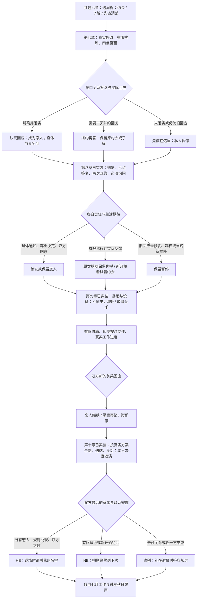

# 周栀线：从热烈到守约

接续成人恋爱版大纲与共通线第六章 `selectedRoute=zhou`。周栀 23 岁，沈知夏 22 岁。两人各有工作与选择；本线把音乐人的日常、舞台之后的劳动、临时改约和稳定联络放在恋爱关系里，双方都需要承担具体责任。

当前第七至十章已实装：第七章 73 个对白场景、12,353 个正文与选项字符，第八章 79 个对白场景、12,179 字符，第九章 60 个对白场景、9,880 字符，第十章 88 个场景、13,932 字符（均含平行分支）。七八章各六次选择 216 种组合，第九章六次选择 144 种组合，共九种阶段回忆。第十章七次选择 288 种组合、三个最终结局与七月、秋日尾声已完成；结局只在读完对应秋日尾声后收藏。

## 第七章《只给你听的副歌》｜六月十九日至二十一日

十九号与见微完成基础校样及印厂真实回执，保留原印数、二十四页与预算。中午按原约确认仍欠的调整，晚上兑现陆遥八点谈话；二十号实际交印。周栀自己确认设备借用与十五分钟曲目，将换场和撤场分别列时。

| 场景 | 冲突、选择与真实回收 |
| --- | --- |
| 十九号中午，排练室或对应伙伴消息 | 具体修改并获确认，或按时承认未准备好；四位旧被忽略者分别回应，不能只修恋爱对象 |
| 二十号下午，排练室 | 听完整试排、问能提供的十五分钟协助、先做自己的工作三选一；周栀自己做技术检查，帮助量与喜欢程度分别记 |
| 排练后的旧街与宿舍 | 椅子、纸杯、换弦、音量和路费构成音乐人的普通生活；陆遥讲她与周栀认识时的笑话，不替周栀评价谁更配她 |
| 二十一号四点，原约或新问过的私人见面 | 吃便宜的点心，再上天台；周栀分享只给知夏听的未完副歌，私人旋律不录、不公开 |
| 原旧调整仍未落实时 | 另获准二十一号四点至四点二十的工作核对，未获得私人邀约；两个工作话题取代点心和私人旋律 |
| 普通一天或她的舞台之后 | 两种私人话题各有完整相处，听到 EP 的花费与她结束商业合作的理由；不通过金钱或接管职业来换靠近 |
| 歌声停下，关系必须亲口答 | 明确提出稳定联络与关系需要；或需要考虑一天、双方约定二十二号十八点再答；或说无所谓却等她猜 |
| 实际改变或继续暂缓 | 写清双方自己的时间和请求，先前让人猜的说法实际改口；仍未准备好则暂停，不拿一首歌当作已谈妥 |
| 天台或街口 | 已有明确答复者另问亲吻、牵手或不接触；需要考虑者保留已有约会或了解，不自动确认恋人；暂停者不新增身体靠近 |

第七章六次选择 **2×3×2×3×2×3＝216 种组合** 已实装。三个阶段回忆：认真回应、按约再答、先停在这里。第八章已实际兑现二十二号十八点的谈话；本章不提前完成未来约定。

## 第八章《别把自由写成失约》｜六月二十二日至二十三日

基础册实际到货、抽检，各自交件。二十二号十八点至十八点十分兑现原联系；按约再答者实际答应继续约会，尚不确认恋人。暂停者实际准备后另获准限定谈话，未准备者只有工作消息。其后双方新答应二十二号二十点半至二十点五十见面；十九点半因二十至二十一点 EP 录音提前六十分钟通知，双方同意改到二十三号十六点至十六点二十。次日十五点五十五只提前五分钟通知；知夏十五点五十已到，四点离开，原约实际未赴。未获准私人邀约者不虚构等待或取消。巡演询问为七月五至十九日、三城五场，二十六号十七点前由周栀本人答复，本章尚未接受或取消。

知夏可提出最低通知与联系需要、承认目前不适应而暂缓、或替她决定应当接受稳定职位并放弃巡演。周栀不被写成只有梦想没有安排的人，也不能用自由解释所有失约。双方各自承担：她发具体通知和新时间、自己与伙伴确认；知夏撤回越权安排，只提出自己真实能接受的关系范围。

另外明确是否想成为排他的女朋友。舞台交流、工作合作、私人约会的范围分别谈，不以检查她的手机或联系所有合作人作为承诺。留宿留到最终章，公开关系另问。六次选择已实装：具体回应、抽检参与、变化回应、双方关系答复、晚间节奏、当晚反馈，共 **2×2×3×3×3×2＝216 种组合**。双方同意后十八点半至十八点五十重新见面，原四点未赴保留；暂停期待者只同意十九点至十九点十分暂停电话。已有女朋友选择有限试行保留称呼与排他约定，新开始者只试着约会；当晚二十一点三十五新说承担不了联系则暂停，同时保留之前实际见面或牵手。职业控制实际撤回也不立即恢复关系。

## 第九章《没有舞台的晚上》｜六月二十四日至二十五日

暴雨使书店后窗漏水，四本实物受潮；电源与设备由负责人确认安全，不能自行通电试运气。原带电演出方案不能照用。周栀可选择不插电十五分钟、缩成八分钟与静默读页、或取消音乐只保留展览；额外补偿与器材租赁需先报价再确认，不能把报价写成已支出。

知夏自己的出版社后续材料仍在二十五号中午十二点截止，实际按时提交。求助和能留下多久提前说；周栀自己联系合作方与技术负责人，伙伴共同搬材料。两人可能重新获得谈话同意，也可能仍暂停；救场不自动成为恋人，演出规模或取消音乐不承担关系门槛。

次日实际核清展示、设备替代或撤回的通知。恋人可另问牵手或只谈话，尚未重新约会者只有获准的限定谈话；不因知道她的排练时间而在门口等。六次选择已实装：旧回应、音乐方案、二十分钟有限帮助或自己工作、当前关系回应、晚间节奏、次日进度，共 **2×3×2×2×3×2＝144 种组合**。二十四号十八点五十五实际受潮、断电停用，十九点二十五方案得到本人、场地与借用方答复；十九点半店主去休息，知夏二十点半完成自己的一轮说明。二十五号九点实际修窗，核新动线后十点才记准备完成，或保留待核并通知不启用；十一点实际自己交件。四本仍隔离，可用五十六或三十六，四十八元仅报价。七八章全部事实保留，巡演尚未接受或取消。

## 第十章《返场时请叫我的名字》｜六月二十五日至三十日、七月及秋日

二十七号告别展实际采用第九章确认的音乐方案：十五分钟与八分钟方案使用已确认的公开曲目，取消音乐者只展示、不暗中补唱。公开只限另获双方同意的两句新现场文字卡，不公布私人收件人、不录或公开原私人副歌；留白也有完整恋爱结局。完整私人副歌只在获准留宿路径、双方另行同意后私下听。

兑现陆遥搬箱、二十八号装箱和晚饭、入口核对、二十九号七点五十出门与九点二十送站、三十号关灯交钥匙。周栀本人决定巡演与 EP 工作，三城五场巡演为七月五至十九日，每场1200元、演出费合计6000元，交通住宿由主办安排。六月二十六号十六点二十本人实际答复，七月五日实际开始、十九日完成五场，不预记报酬已结清。知夏六月二十六日自己接受编辑岗位，七月一日实际入职，恋爱不替任何一方取消职业。

已谈妥的女朋友另约不夹带工作的晚饭，再问留宿、只聊天或回家。双方进一步亲密后淡出，次日早餐或电话回收；身体接触与公开不承担结局门槛。重新恢复发展者不自动得到留宿邀约。

| 已实装最终结局 | 关系与秋日回收 |
| --- | --- |
| HE《返场时请叫我的名字》 | 双方愿意继续，联系与通知规则在实际生活中兑现；她如期巡演、知夏开始工作，秋日普通下班约会 |
| NE《把副歌留到下次》 | 愿意继续但选择有限试行，或刚恢复发展；原女朋友身份与新开始约会分别保留，认真答复不等于保证成功 |
| 离别《别在谢幕时答应永远》 | 未回应的失约与控制、生活期待不合或任一方结束；活动完成、职业继续，私人关系有清楚告别 |

## 四章已实装分支树

第十章七次选择为旧回应、职业期待、公开寄语、现场岗位、晚间节奏、联系安排、最后意愿，共 **2×2×3×2×3×2×2＝288 种组合**。六月三十日先获准约七月七与十四日电话；如最终告别，双方随后明确撤回未来预约，预约历史保留；未获准者不虚构预约或取消。继续者七日实际通话，十四日提前150分钟通知、双方改到21点并实际兑现。原女朋友有限试行保留身份；原约会继续不重复起算，原暂停后仅再谈者最终双方答应才开始新约会。全部既往授权与存档标识保留；不回填缺席的第四章演出、原迟到或已拒绝的私人影像。
