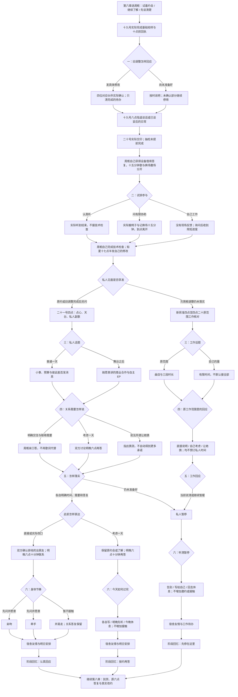

# 周栀线第七章《只给你听的副歌》分支结构

六月十九日至二十一日。73 个对白场景、9 个回流节点，正文与选项 **12,353 字符**，含所有平行分支。六次选择共 **2×3×2×3×2×3＝216 种组合**。

“按约再答”入口保留之前的真实状态：此前试着约会者仍为 `tryingDates`，了解或本章重新获准相处者为 `gettingToKnow`。二十二号十八点谈话尚未发生，不能提前记作完成。确认恋人的三种身体节奏都进入“认真回应”；试排参与和帮助量也不承担关系门槛。

具体工作未落实时，本章一句清楚的话不能替代原修改；只有原范围二十分钟核对，不出现点心、私人副歌或亲吻。被忽略者为其他伙伴时，其工作待办独立保留，不用周栀的关系答复清掉。

私人旋律只在实际私人场景分享，不录、不公开；原信、影像权限和预算保留。旧第四章缺席不补标记；实际回执、交印、借用答复、关系与身体接触只在读完对应场景后记录。

回忆标识：`z7_open`《没有伴奏的答案》、`z7_slow`《明晚六点，各自带来一句真话》、`z7_distance`《琴放下以后，也能听见暂停》。均为阶段记录，非最终结局；第八章已实装，第九至十章均已实装，路线场景见《周栀线_四章路线场景表》。
