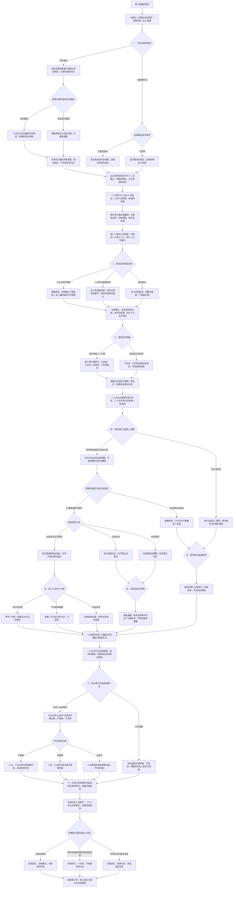

# 周栀线第九章《没有舞台的晚上》分支结构

六月二十四日至二十五日。**60 个对白场景、11 个回流节点、9,880 个正文与选项字符**，包含所有平行文本。六次选择共 **2×3×2×2×3×2＝144 种组合**。第八章三种回忆均可显式继续。

“愿意再谈”明确分两种：前章 `tryingDates` 继续原约会；前章私人暂停者只获准新谈话，仍为 `needsConversation`，`z9DatingResumed=false`。原女朋友包含第八章选择有限试行联系的人；本章愿意继续时保留称呼与排他约定，不因没有身体接触或帮助较少而降格。

旧暂停必须有实际回应，当前期待也须分别答复。即使一起搬过椅子、说清当前一句话，未落实的旧修改或私人回应仍会保留暂停；最后的积极答复不替它们完成。撤回职业要求只补记今天真实撤回，原第八章没有撤回的事实不改写。

三种音乐方案均由周栀本人答复、场地确认，并由本人通知借用方。次日核完干燥动线才记准备完成；准备、报价、活动举办、巡演询问分别记录。**四本持续隔离，原印数与二十四页不改，四十八元未支付**。原扩音不恢复，取消音乐不暗中补唱；告别展尚未发生。

音乐长短或取消、协助量、牵手或不接触、次日准备完成或暂缓均不决定恋爱回忆。所有路径保留自己十一点按时交件、店主休息、林晚原说明会、陆遥未来搬家与原信、旋律、影像权限；七八章全部 `z7`、`z8` 事实不回填。

回忆：`z9_together`、`z9_reopen`、`z9_paused`，均为阶段记录，非最终结局。完整文本见《周栀线_第九章_没有舞台的晚上》，第十章完整剧本与分支见《周栀线_第十章_返场时请叫我的名字》和《周栀线_第十章_分支结构》。
