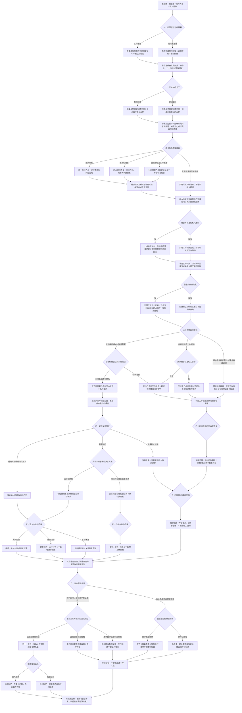

# 周栀线第八章《别把自由写成失约》分支结构

六月二十二日至二十三日。79 个对白场景、20 个回流节点，正文与选项 **12,179 字符**，含全部平行分支。六次选择共 **2×2×3×3×3×2＝216 种组合**。第七章三种回忆均可显式继续，保留原工作、关系和授权事实。

三本抽检由已确认的人实际完成；共同核查与分别承担、牵手与不接触均不决定恋爱回忆。最后仍愿意继续且选择恋人答复进入 `z8_together`；选择有限试行进入 `z8_slow`，其中原女朋友保留称呼，新开始者为 `tryingDates`。任何尚未落实的旧暂停、职业控制、主动暂停或当晚不能承担联系进入 `z8_paused`。积极的最后一句话不能覆盖尚未回应的问题。

原六点联系、八点半新邀约、次日四点未赴约、六点半重新见面分别记录；没有私人同意就没有私人取消或等待。实际改约、电话、见面与牵手须读完对应场景才登记。第七章全部 `z7` 事实保留，当前关系变化写在本章；此前亲吻与未来计划不回填成当天的事件。

巡演仅为**七月五日至十九日、三城五场**合作询问，**六月二十六日十七点**前由周栀本人答复。本章没有接受、取消、购票或出发。原私信、私人旋律、影像用途与工作权限保留，关系不自动公开；本章没有留宿。

三个回忆均为阶段记录，非最终结局。完整文本见《周栀线_第八章_别把自由写成失约》，第九至十章均已实装，路线场景见《周栀线_四章路线场景表》。
