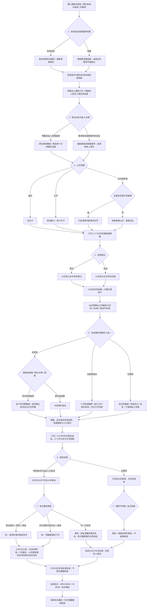

# 周栀线第十章《返场时请叫我的名字》分支结构

88 个场景、24 个回流节点，13,932 个正文与选项字符（含所有平行分支）。七次选择 **2×2×3×2×3×2×2＝288 种组合**，三种最终结局。唯一文本源为 `chapter-ten-zhou.js`；节点使用 `zhou10`，第九章旧存档可直接续章。

原第七至九章的职业要求、撤回、改约、真实缺席、准备与演出尚未发生等标记全部保留。新经历另记在第十章；原暂停者回应后只再谈，六月三十日双方才同意新约会。原约会继续不重复起算，女朋友有限试行保留称呼和排他约定。

留宿、公开寄语、音乐方案与岗位不决定结局。两句新文字仅现场卡，不公开私人收件人或原副歌。取消音乐路径不补唱；原四本隔离、可用印数与二十四页保留，48元只有报价。若在亲密之后告别，已发生的晚饭、亲吻和留宿保留，同时实际撤回未来电话；工作、友情、巡演与秋日不会被告别取消。

业务：本人六月二十六日16:20接受七月5至19日三城五场巡演，每场1200元、演出费合计6000元，交通住宿由主办安排。实际出发与五场完成分别记录；知夏七月1日自己入职。继续路径七月14日18点提前150分钟通知，双方改约到21点并实际通话。

阅读版见《周栀线_第十章_返场时请叫我的名字》，自动化与浏览器记录见《周栀线_第十章_验证记录》。下一阶段为叶澄线与独身收束篇。
