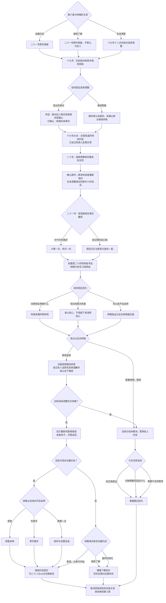

# 林晚线第七章《我们已经不是那年夏天》分支结构

时间：六月十九日至二十一日。第六章正式选择林晚后，在章节回忆页点击「继续林晚线第七章」。其余人物方向及独身方向停在各自第六章回忆，不会被自动送进林晚线。

## 故事树

## 选择与后果

五次选择：调整回应 2 × 初见回应 2 × 冲突回应 3 × 后续行动 2 × 靠近方式或告别方式 3 = **72 种本章组合**。连同共通线共三十八次选择。

| 第六章入口 | 本章如何承接 |
| --- | --- |
| `tryingDates` | 已在试着约会；分歧谈妥后才显示亲吻、牵手、放慢三选一 |
| `gettingToKnow` | 不称作已确定关系；本章实际相处后，由林晚重新发起约会邀请 |
| `needsConversation` | 先处理十九号十二点的调整；完成后重新问私人时间，未完成则只同意谈话 |

| 本章行为 | 可见影响 |
| --- | --- |
| 只口头说理解，随后暂停 | 保留隔阂，私人约会暂缓 |
| 先说「你以前不会这样」，再修改安排 | 先承认具体伤害，再实际修改；林晚可以仍然难受，不要求马上原谅 |
| 行程分歧谈妥，旧调整仍欠林晚 | 不进入散步亲近；旧问题不能被新问题的修复抵消 |
| 仍欠其他伙伴调整 | 保留该伙伴的 pending 与停用范围，林晚关系可以独立发展 |
| 选择牵手或不进行身体接触 | 与亲吻一样可以进入「继续约会」章节回忆，不降级关系 |
| 以前缺少完整重点相处 | 不补发第四章事件标记；可依据今天实际发生的相处重新决定试着约会 |

## 日期与继承

- 十九号十点：三种筹备方案均实际核对并收到最终确认回执。独自修改路线补完剩余校样，保留十七号未完成的历史及十九号新期限。
- 十九号十二点：具体调整发出、修改并得到一项确认后，才清除待谈；仅回复尚未做好仍保留待谈。旧 `repairActionKept` 不改写。
- 十九号二十点：此前仍欠陆遥谈话时实际兑现，完成后才清除 `pendingLuConversation`；此前已谈则用友情日常承接。
- 二十号：实际交印，有回执；不宣称到货或展览完成，待确认的现场材料继续独立存放。
- 二十一号十五点：原约或重新确认的见面；未完成调整时仅接受谈话，不虚构约会。
- 二十四号实习说明会、七月六周实习继续保留。二十九号陆遥送站约定也保留。
- 只有「继续约会」明确约定二十二号十四点交换新信；慢慢了解和暂缓路线的下次时间尚未确定。

## 收藏与技术

新增三种章节回忆：`l7_open`《把今天写在第一页》、`l7_slow`《各自翻开的本子》、`l7_distance`《还没说完的那一页》。读完本章时累计二十八种章节回忆，第八章另增三种；本章不是最终 HE、NE 或离别结局。

`chapter-seven-lin.js` 是唯一对白源，阅读版由 `scripts/build_chapter.cjs` 生成。章节继续由引擎读取第六章 `selectedRoute`，仅 `lin` 对应已实装入口。旧节点、存档键与剧情身份保留，旧第六章存档恢复后即可继续，不追加或重写旧选择。第七章三种回忆均可继续第八章，原关系状态与待谈事项带入。历史回看仍从真实决策前缀重放，不带入未来关系或交印状态。
