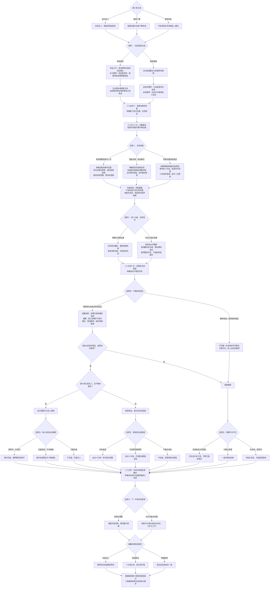

# 林晚线第九章《雨夜的站台》分支结构

时间：六月二十四日至二十五日。第八章三种回忆均可带着原有选择继续。本章 58 个对白场景，正文与选项约 11,018 字符（含平行分支），六次选择共 144 种组合。

**2 × 3 × 2 × 2 × 3 × 2 = 144 种本章组合**。第五次选择依真实关系更换内容，每条路径都恰好六次；连同此前八章共五十次选择。三种回忆是阶段记录，最终 HE、NE 与离别结局在第十章展开。

| 条件或选择 | 实际后果 |
| --- | --- |
| 第八章暂停，本章继续暂缓 | 即使今晚求助说得具体，也不能自动跳过此前的私人分歧 |
| 第八章暂停，本章实际回应 | 只打开继续谈的空间；不自动确认恋人或恢复约会 |
| 隐瞒困难 | 增加受潮损失；伙伴仍会具体求助，不把独自崩溃写成独自完成 |
| 以喜欢施压 | 说明会照常参加，约会暂停；之后道歉也只得到继续谈的机会 |
| 现场交接 | 夜间编号清单完成；作者对展示与处理的答复仍待 |
| 继续独自处理 | 材料已经由伙伴移好，夜间编号清单未完成；次日实际补核并保留原事实 |
| 牵手、只谈话或休息 | 均可保留恋人回忆，不把身体接触或雨夜见面作为关系进展条件 |
| 未被邀请见面 | 不去林晚的站台；公交背景只用于与陆遥回宿舍的另一侧站台 |
| 群像与资源 | 店主休息有效，伙伴各有可给的时段，林晚说明会实际参加；原预算、印数、旧信与影像权限不变 |

`chapter-nine-lin.js` 是对白源，阅读版由 `scripts/build_chapter.cjs` 生成。保留已发布八章的节点、剧情身份与存档键，原章末只新增继续入口。按真实决策恢复或回看第四章分歧，不带入未来关系、受潮损失、协作或站台相处状态。
