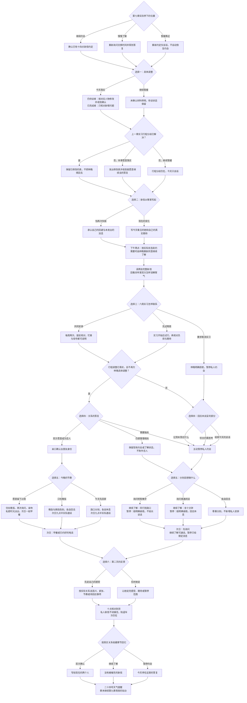

# 林晚线第八章《那封信没有写完的部分》分支结构

时间：六月二十二日至二十三日。第七章回忆页可直接继续，三种关系状态和所有既往选择保留。共 58 个对白场景、六次选择、216 种本章组合，正文与选项约 10,241 字符（含平行分支）。

六次选择为 **2 × 2 × 3 × 3 × 3 × 2 = 216**。第四、五次选择的内容随真实关系变化，每条路径仍恰好六次；连同前面七章共四十四次选择。这是选项组合数，不等于 216 个最终结局。

| 实际行为 | 状态与后续 |
| --- | --- |
| 今天兑现旧调整 | 只有发出、修改并收到确认后才清除待谈；旧章节完成标记不回填 |
| 今天修改实习冲突 | 记录本章实际修复；第七章当时未解决的事实保留 |
| 读过新信 | 记录双方读过与私人范围，不更改旧信、录像、播放许可 |
| 要求取消实习 | 被明确拒绝，无法继续确认恋人关系或邀请留宿 |
| 确认恋人后回家 | 仍是恋人，有实际次日电话；不要求过夜以获得恋人回忆 |
| 继续慢慢相处 | 保留原有试着约会或继续了解状态，不自动成为女朋友 |
| 暂停后请求闲话或散步 | 林晚明确谢绝；选择不会绕过暂停制造额外亲近 |
| 次日反馈 | 早餐在住处、电话在宿舍、暂停用限定消息；不将消息当作自动复合 |

`chapter-eight-lin.js` 是对白源，阅读版由 `scripts/build_chapter.cjs` 生成。原剧情身份、存档键与第七章节点保留。旧章末只新增下一章入口，恢复时按原决策重放；返回第四章相处分歧会清除其后的关系、读信、交印与留宿状态。

三种回忆为本章阶段记录；原第八章末存档可直接继续第九章，最终结局在第十章展开。
