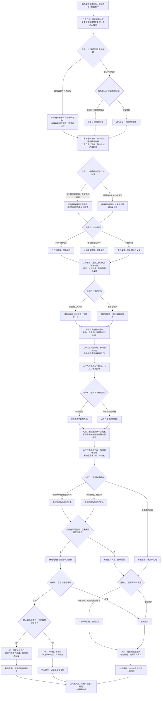

# 林晚线第十章《晴天留给我们》分支结构

本章接续第九章三种阶段回忆，完成六月二十五日至三十日的告别与九月尾声。下图列出七次选择和实际回流；身体亲近、公开寄语及活动分工都不计入结局条件。

**2 × 2 × 3 × 2 × 2 × 3 × 2 = 288 种本章选择组合**。每条路径均有七次选择，与此前九章合计五十七次。第十章直接收藏三个最终结局，不新增阶段回忆卡；全游戏当前共三十四种章节回忆与三个林晚最终结局。

| 判断 | 对应结果 |
| --- | --- |
| 第九章仍是恋人；本章谈妥现在的期待；双方同意常规联系且继续 | HE《晴天留给我们》 |
| 仍是恋人但双方选择先试两周 | NE《下一封，寄给你》，恋人身份保留 |
| 第九章愿意再谈，或暂停后本章实际修复；本章双方同意联系与继续 | NE《下一封，寄给你》，明确重新试着约会 |
| 第九章暂停，本章仍暂缓回应 | 联系安排未获同意，最后请求继续也不能跳到恋爱结局 |
| 坚持回到从前，或要求取消实习出发 | 林晚明确拒绝，进入离别 |
| 条件已谈妥，玩家最后仍选择结束 | 离别，完成工作和旧信不要求继续关系 |
| 是否留宿、是否写公开寄语、朗读或照看桌子、友情答复 | 分别有可见后续，不决定 HE / NE / 离别 |

送站日期保持陆遥六月二十九日九点二十；林晚六月三十日十六点二十出发，七月一日报到，实习六周。三段尾声均回收她的实习、知夏九月入职、伙伴们各自继续生活。关灯与交还钥匙不是依恋爱结局才能完成的奖励。

`chapter-ten-lin.js` 是对白源，阅读版由 `scripts/build_chapter.cjs` 生成。原第一至九章存档标识与节点保留，第九章末可直接续接。实际完成的待谈只在收到确认以后清除，旧章节的暂停、受潮损失、留宿和权限事实保留；恢复按实际选择重放，回看第四章不携带未来状态。
