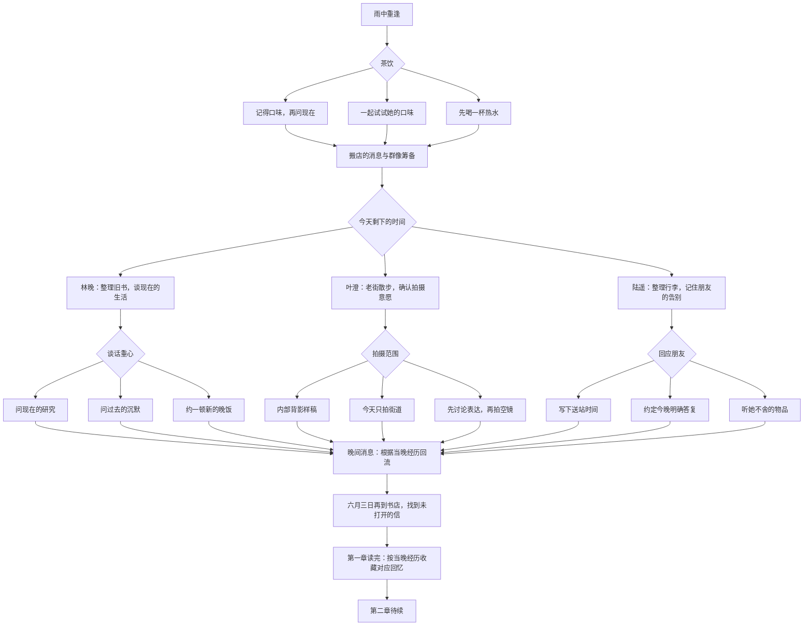

# 第一章《百分之二十的雨》分支结构

共通开场 → 茶饮三选一 → 公共筹备 → 当晚去向三选一 → 对应支线的回应三选一 → 夜间差分回流 → 找到旧信 → 第一章待续。

三次选择共有 27 种组合。茶饮与支线回应保存具体标记，章节回忆由当晚去向决定。所有组合均能继续到找到信封的位置，信在第二章才会一起打开。

后续可继续使用的标记：`tea`、`firstEvening`、`linConversation`、`filmingConsent`、`luResponse`、`luMoveDate`，以及对应事件经历。它们保存具体信息，不换算成单一好感分数。
