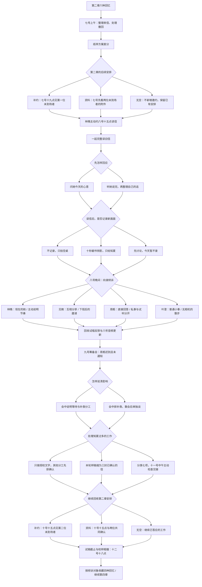

# 第三章《收件人》分支结构

时间：六月七日至十日。第二章末尾选择「继续第三章」，带入原有选择和对话历史。四位倾诉对象均开放；读林晚的信不直接锁定恋爱路线。

## 第二章的补约如何落地

顺序以第二章四项活动表为准：林晚 → 许见微 → 周栀 → 叶澄。下表列出未选择的两位，不受已选择活动的先后顺序影响。

| 第二章活动组合 | 七号十九点（补约第一位） | 十号十五点（补约第二位） | 资料方案十号到场 |
| --- | --- | --- | --- |
| 林晚 + 许见微 | 周栀 | 叶澄 | 周栀、叶澄 |
| 林晚 + 周栀 | 许见微 | 叶澄 | 许见微、叶澄 |
| 林晚 + 叶澄 | 许见微 | 周栀 | 许见微、周栀 |
| 许见微 + 周栀 | 林晚 | 叶澄 | 林晚、叶澄 |
| 许见微 + 叶澄 | 林晚 | 周栀 | 林晚、周栀 |
| 周栀 + 叶澄 | 林晚 | 许见微 | 林晚、许见微 |

选「近期没有额外空档」时，不显示上述补约，也不把它记成失约。人物照常参与筹备。

## 选择与后续记录

| 选择 | 标记 | 可见结果 / 后续使用 |
| --- | --- | --- |
| 读信回应 | `letterResponse` | 两种当场对话；均完整读信，`pendingLetter = false` |
| 是否记录 | `cameraScope`、`privateClipRecorded` | 不录 / 十秒只给自己 / 讨论但不录；私人信件始终不公开 |
| 倾诉对象 | `confidant` | 四段独立谈话与四种回忆，全部开放 |
| 倾诉内部回应 | `confidantReply` | 对方具体回应，保留私人邀约意向或相处节奏 |
| 迟到谈话 | `reliability` | 会中说明 / 散会后单独谈；均不免除设备补救责任 |
| 工作安排 | `workload`、`workPlan` | 分工 / 缩小样稿 / 设置检查点；章末邮件有不同回应 |

第三章：读信回应 2 × 记录选择 3 × 倾诉对象 4 × 倾诉回应 2 × 迟到谈话 2 × 工作方案 3 = **288** 种组合。

四种回忆为《给今天的林晚》《版面以外的一段话》《把琴放下以后》《不进片子的晚上》。它们是章节相处记录，不是最终恋爱结局。

第四章已接入：六月十一日九点毕业典礼、十二点工作检查；十二日十八点前实际交出试稿和活动文字；十八点半的私人邀约进入提前说明、另约时间或两头赶的不同场景。读信、影像范围、倾诉对象及回应、迟到补救、分工和实际赴约均保留在存档中。具体见《第四章_分支结构.md》。
