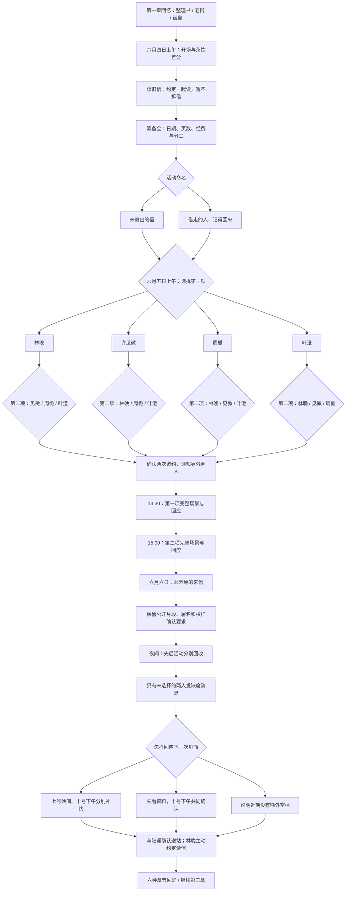

# 第二章《借走的人，记得回来》分支结构

第一章末尾的三种回忆均可选择「继续第二章」，带入茶饮、傍晚去向、支线回应及完整对话记录。旧版第一章书签同样可继续。

## 四项活动中的内部选择

| 人物 | 场景 | 两种回应 | 保存标记 |
| --- | --- | --- | --- |
| 林晚 | 修复植物图鉴；写新的借阅卡 | 主动分工 / 请她完整示范 | `bookRepair: divide / learn` |
| 许见微 | 工作室选纸；楼下短暂休息 | 清晰内页与大字原信 / 有手感的封面与文字转录 | `paperPlan: readable / textured` |
| 周栀 | 排练室听未完成的歌 | 提出具体听感 / 分享自己的告别联想 | `songFeedback: specific / personal` |
| 叶澄 | 读者不想公开过去；没有相机的散步 | 邀请空手到场 / 留联系方式后告辞 | `interviewExit: invite / contact` |

只有参加的两项活动会得到对应记录。拍摄授权沿用第一章原有范围，第二次同行不自动扩大用途。

## 六种章节回忆

| 两项活动（顺序均可） | 回忆 |
| --- | --- |
| 林晚 + 许见微 | 书页与纸纹 |
| 林晚 + 周栀 | 借阅卡上的旋律 |
| 林晚 + 叶澄 | 窗边到巷口 |
| 许见微 + 周栀 | 纸样与未完成的歌 |
| 许见微 + 叶澄 | 留下的纸，没有留下的影像 |
| 周栀 + 叶澄 | 街口的静音与副歌 |

组合决定回忆种类，顺序改变活动时间与章末消息。不是恋爱路线锁定：未选择的人仍有主动回应，后面的个人路线不会因此关闭。

第二章组合数：命名 2 × 首项 4 × 次项 3 × 首项回应 2 × 次项回应 2 × 章末回应 3 = **288**。连同第一章 27 种，共 **7,776** 种完整选择组合。

第三章已接入，读取两项活动、内部回应与补约安排；保留郑素琴允许展出的片段、署名要求与陆遥的送站日期。第三章会正式读旧信，并实际兑现七号、十号的补约或资料确认。
