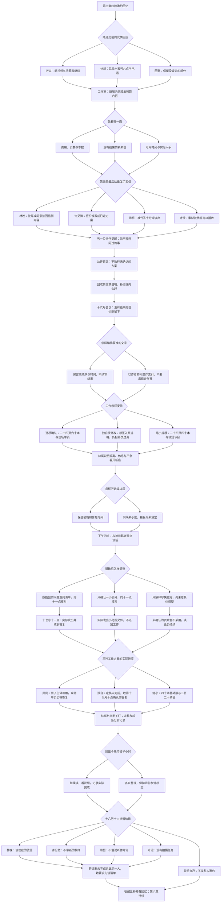

# 第五章《不是所有空白都要填满》分支结构

时间：六月十五日至十七日。第四章末尾选择「继续第五章」，保留之前的赴约、友情、分工及影像范围。第十八日的私人安排仍不锁定恋爱路线。

沟通失误是必经事件，不因选择预算切入方式而跳过。`omittedPerson` 来自第四章 `activeMessage`；提醒者来自 `priorityInvite`，若两者相同，改用人物表的下一位，顺序为林晚 → 许见微 → 周栀 → 叶澄 → 林晚。

## 活动方案的差别

| 方案 | 实际形式与预算 | 十七号进度 |
| --- | --- | --- |
| 共同分工 | 二十四页、六十本；印刷与夹具、运输共 1080；获准材料可另做现场单页 | 册子主体可用，单页有待原作者答复，不先采用 |
| 独自修改 | 二十四页、六十本；同预算；知夏接新增文字修改 | 未完成定稿，实际获准延至十九号十点确认，二十号交印排期保留 |
| 缩小规模 | 二十四页、四十本；合计 860，预留 220；较短的朗读与歌曲 | 基础版可核对，不补印或增加手工作业填满空余 |

数字为故事中的活动报价。三个方案都保留可读字号、末页空白与未经确认材料的待定状态。郑素琴仅授权圈出片段、她自己的署名，收件人信息不公开；新试排再次得到她的确认。私人旧信、私人翻书画面和撤回投稿不变成新增活动材料。

## 道歉与友情

| 选择 | 可见结果 | 记录 |
| --- | --- | --- |
| 重列清单 | 四位有不同的调整任务，十七号十一点实际核对 | `repairStarted = true`、`repairActionKept = true` |
| 限定一项 | 得到小范围答复，按时核对，不追加其他内容 | `omittedContribution = limitedPartOnly` |
| 仅解释 | 未确认的贡献暂不采用，关系谈话仍需继续 | `repairStarted = false`、`pendingOmittedConversation = true` |
| 与陆遥继续谈 | 实际看新视频与问题表，听她说离开前的生活 | `luConversationContinued = true`、`pendingLuConversation = false` |
| 今晚各自整理 | 保留已发生的修复与已完成电话；此前未谈的仍待续 | 不覆盖此前 `friendshipRepair`、`pendingLuConversation` |

私人邀约不是修复的替代品。若邀请的是尚未给出调整的被忽略者，她会明确要求十八号先把清单说清，记录 `meetingTone = cautious`；其他邀约记录 `open`。两者都不自动确立恋爱关系。选择给自己留时间时，不凭空出现某人在等见面。

## 组合、回忆与存档

预算切入 3 × 来信编排 2 × 工作方案 3 × 林岚谈话 2 × 道歉调整 3 × 友情回应 2 × 次日安排 5 = **1,080 种组合**。每条路径七次选择，连同前四章共二十九次。

三种回忆为《分别回答过的名字》《没有被假装完成的十七号》《一场可以做完的告别》，按 `workflow` 收藏。`nextInvitation` 可以是林晚、许见微、周栀、叶澄或自己，与前章倾诉、优先相处和本章被忽略者分别记录。

前四章原有节点、剧情标识与存档键保留，旧书签及章末存档能继续第五章。第五章回忆页可带着原有选择继续第六章《我想见的是你》，私人邀约会在次日确认或提前通知变更。
