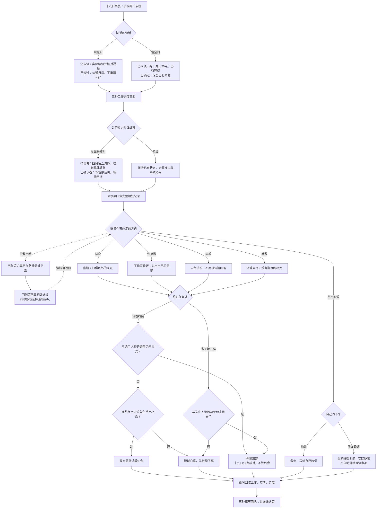

# 第六章《我想见的是你》分支结构

六月十八日。共通线在本章结束；四位人物方向均可继续各自的第七章，独身方向可继续《写给自己的信》。林晚、许见微与周栀路线均已完成各自第七至十章、三种最终结局及秋日尾声；叶澄第七至十章与三个最终结局已可玩，独身群像收束篇《写给自己的信》也已接入，十三个最终结局全部可玩。对白唯一来源为 `chapter-six.js`，完整阅读版由 `node scripts/build_chapter.cjs` 生成。

所有人物分支及独身分支的赴约前，都先处理第五章的原约定：同一人则确认时间与地点；换人或改独处则先通知原对象，收到回复以后再作新约；原来选择自己时，无须凭空取消一场约会。五种原安排 × 五种新方向，共二十五种调度场景。许见微的见面地点由楼下店铺改为工作室，会明确说明检修并征得双方同意；周栀会邀请上开放的天台，知夏明确答应。

## 四类关系回应

| 条件 | 关系记录 | 具体结果 |
| --- | --- | --- |
| 表达约会意愿、完整相处、与她的调整已谈妥 | `tryingDates` | 双方同意试着约会，约好二十一号再见 |
| 希望慢慢了解，或缺少完整重点相处 | `gettingToKnow` | 继续私人相处，尚未确定恋爱关系 |
| 选中的人物仍在等待具体调整 | `needsConversation` | 两种意愿均得到先谈清楚的答复；十九号中午核对，私人邀约另定 |
| 暂不恋爱 | `notDating` | 独处或朋友晚饭，继续自己的生活 |

重点相处来自第四章完整赴约的 `L_present`、`X_need`、`Z_reality`、`Y_withoutCamera`。两头赶不补发标记。本章显示已经历及缺少的重点事件，允许自由选择人物方向；选择方向不直接等于成立恋爱关系。

上午真实完成迟来的调整后，新增 `sixthRepairActionKept`，保留第五章 `repairActionKept = false` 的历史事实。只采用对方此次明确确认的一项，不改变私人信件、影像或其他人的授权。已完成的修复不因今天留空间而退回；仅约明天谈仍保留 pending 状态。

## 回看书签与存档

第六章五选一界面显示「回到第四章相处分歧」。进入该选择时自动保存独立的「路线分歧书签」。确认回看后，引擎按原选择从开头重放到 `c4_choose_priority_0`，保留之前十六次选择，之后的工作、赴约和关系状态需重新经历。

原第六章进度可从读档返回，四个手动书签与回忆收藏不受影响。重新走到第六章选择处时，路线分歧书签会更新为新的经历。回看不会把另一条路线的未来标记带回过去，也不能跳到未曾走过的场景。

## 组合与收藏

友情 2 × 调整 2 × 方向 5 × 关系回应或独身安排 2 = **40 种本章选择组合**，每条四次选择，连同前五章共三十三次。既往重点相处、道歉对象、工作方案、友情进度及第五章邀约会产生额外差分。

按正式选择的方向收藏五种回忆：《窗边，重新认识你》《不用带校样的晚饭》《不需要押韵的回答》《没有题目的同行》《寄给自己的下一页》。共通线累计二十五种章节回忆；不同关系状态保存在进度中，章节回忆不等于长篇十三个最终结局。
