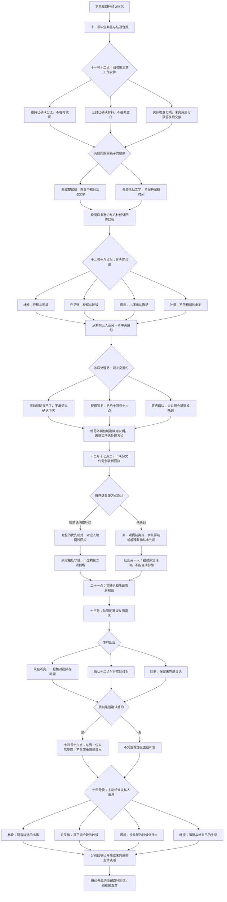

# 第四章《同一把伞以外》分支结构

时间：六月十一日至十四日。第三章末尾选择「继续第四章」，带入全部选择、信息与历史。四位邀约对象全部开放；重点相处、另一次邀约和章末主动消息分别记录。

图中交稿场景复用，实际处理方式一直保留；完整相处与提前离开的对白分别实现。图上汇合不会抹掉选择。

## 重点相处与对应回应

| 优先人物 | 完整相处 | 两种回应 | 完成标记 |
| --- | --- | --- | --- |
| 林晚 | 确认换乘、河堤散步，听她期待的六周调查 | 商量联系 / 继续听研究 | `L_present` |
| 许见微 | 分清八页工作的状态，留下私人相处 | 半小时有限帮助 / 先休息吃饭 | `X_need` |
| 周栀 | 听完演出、看到设备补救与撤场 | 搬椅子收杯子 / 明确半小时帮助 | `Z_reality` |
| 叶澄 | 看完整场电影，在镜头外交流 | 分享普通生活 / 留一段安静 | `Y_withoutCamera` |

两头赶时，第一项改为短暂到场与早退的场景，各有「承认未提前说明」和「解释想两边去，同时承认未先问」两种回应。叶澄的电影尚未开始，周栀的演出只听到前两首；不会显示看完、听完后的对白。随后到第二处，看见她已按自己的安排完成或结束活动。

## 约定与友情的实际结果

| 选择 | 可见结果 | 存档记录 |
| --- | --- | --- |
| 提前说明 | 完整参加优先相处；另一人按自己的安排继续 | `notified = true`、`keptPromise = true`、无补约 |
| 另约时间 | 完整参加优先相处；十四号十六点另一次真实见面 | `rebooked = true`、`rebookKept = true`、`secondaryExpectedEventMissed = false` |
| 两头赶 | 早退第一处、错过第二处；道歉不改成完成 | `notified = false`、`keptPromise = false`、`priorityCompleted = false`、`secondaryExpectedEventMissed = true` |
| 现在听陆遥 | 实际一起看视频、列出待问问题，修复开始 | `friendshipRepair = started`、`luVideoChecked = true` |
| 约十二点半 | 得到答复并按时核对，具体计划得到兑现 | `friendshipRepair = planKept`、`luVideoChecked = true` |
| 暂时回避 | 没有自动和好，后面仍需要继续谈 | `friendshipRepair = deferred`、`pendingLuConversation = true` |

二十九号九点二十的车次是此前已知信息，本章补充送站出宿舍时间与入口核对计划，保留 `luMoveDate`。之前陪过陆遥仍然算数，也不能抵掉十二号二十一点的失约。

## 选择、回忆与存档

交稿顺序 2 × 优先邀约 4 × 冲突邀约 3 × 处理方式 3 × 当场回应 2 × 友情回应 3 × 主动私信 4 = **1,728 种组合**。每条路径七次选择，连同前三章共二十二次。

`priorityInvite` 与 `otherInvite` 组成十二种有顺序的组合，补约与迟到场景按后者展开。`activeMessage` 可以自由选择四人，不强制等于优先邀约、补约或第三章倾诉对象。旧信、影像范围与之前的分工不会被本章选择覆盖。

四种回忆为《河堤边的约定》《校样之外的时间》《开场与散场之间》《没有镜头的一次邀约》，按 `priorityInvite` 收藏，既保存完整赴约也保存两头赶的真实过程。回忆仍是章节记录，个人恋爱路线尚未锁定。

前三章原有书签与章末自动存档可继续使用。第四章结束后可选择继续第五章《不是所有空白都要填满》，按本章最后私信对象展开对应的沟通失误与道歉。
