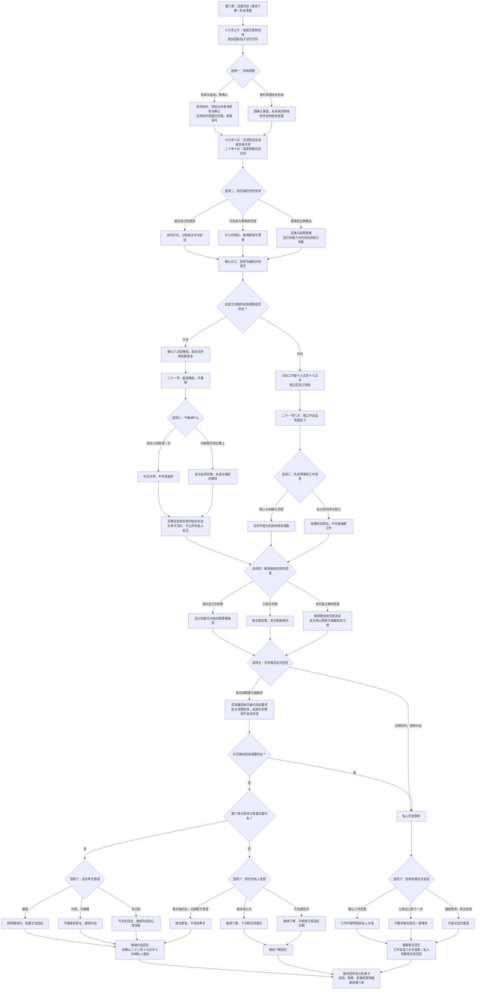

# 许见微线第七章《校样上的私人批注》分支结构

从共通线第六章明确选择许见微进入。林晚与周栀方向进入各自的第七章，叶澄与独身方向仍保留存档等待后续。本章六次选择固定出现在每条路径，私人晚饭与限定工作谈话分别使用对应对白。

**2 × 3 × 2 × 3 × 2 × 3 = 216 种本章组合**。第三次与第六次选择按实际见面范围、既往关系更换内容，每条路径均有六次；连同共通线累计三十九次选择。

| 情况 | 阶段回忆与实际后果 |
| --- | --- |
| 第六章已试着约会，本章实际调整并继续 | 继续约会；牵手、并肩或先回去均有效 |
| 第六章继续了解，本章实际调整并双方愿意开始 | 继续约会，牵手不自动发生；旧重点相处不补发标记 |
| 原欠见微调整，本章实际兑现后重新问私人时间 | 得到新晚饭邀请，按本次真实意愿开始约会或继续了解 |
| 原欠见微调整，本章继续暂缓 | 只有限定工作谈话；不会看到面馆、过去分享、私人批注或牵手 |
| 私人期待仍没准备好，选择暂停 | 晚饭与已分享的故事保留为事实，私人约会暂停 |
| 其他伙伴的调整未完成 | 见微的约会不清除那位伙伴的待谈；新增内容继续停用 |
| 二十号抽检讨论 | 完成的是分工确认；未到货、未抽检事实保留，不提前记已检查 |
| 工作方案、预算与权限 | 原印数、二十四页、预算与旧信影像范围保留；私人批注不交印、不公开 |

三个回忆都是章节记录，许见微最终 HE《与你一起留白》、NE《装订之前》与离别《折痕以外》已在第十章实装。

对白源为 `chapter-seven-xu.js`，阅读版由 `scripts/build_chapter.cjs` 生成。原剧情身份、林晚节点和共通线存档键保留；原第六章许见微方向可直接继续。恢复按真实决策重放，回看第四章不带入未来的许见微关系、批注、交印或接触状态。
