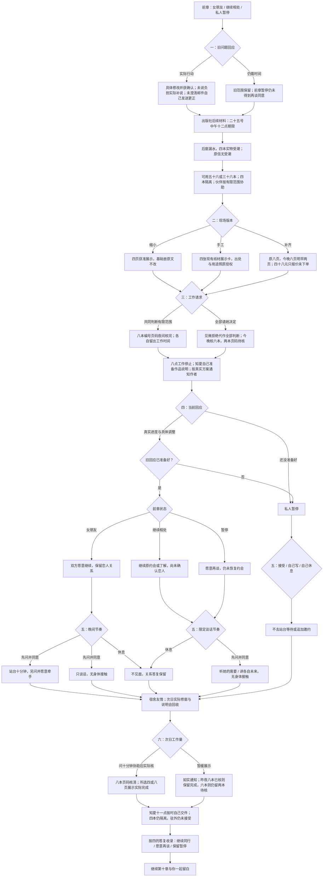

# 许见微线第九章《这一页不必独自完成》分支结构

六月二十四日至二十五日。由许见微线第八章末继续，六次选择共 **2×3×2×2×3×2＝144 种组合**。70 个对白场景，三种阶段回忆，最终结局已在第十章实装。

第六次选择改变工作完成量，保留之前双方真实给出的关系答复。规模、手工与否、暂缓展示、牵手与否均不承担恋爱门槛。

前章暂停者即使旧问题已落实，也只得到新的谈话同意；`relationshipStatus` 仍为 `needsConversation`，`xu9DatingResumed=false`。前章仍在了解者保留原约会或了解状态，不自动确认为女朋友。

实体受潮与已印二十四页分别记录：原印数、到货与抽检不回写，四本隔离后可用数量减少四本。窗口修好不恢复受潮实物。四十八元只问报价，没有订单或费用支出。

阶段回忆：`x9_together` 继续同行、`x9_reopen` 愿意再谈、`x9_paused` 保留暂停。第十章已收束驻外决定、告别展、陆遥送站与秋日尾声。
