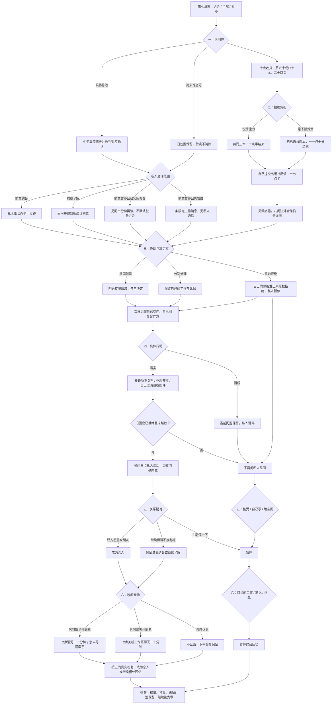

# 许见微线第八章《可靠的人也会失眠》分支结构

六月二十二日至二十三日。由许见微第七章末继续，六次选择共 **2×2×3×2×3×3＝216 种组合**。前章状态决定通话与私人见面的范围，不补写七章未发生的事实。

共同讨论与有限的分别协助都可发展关系。擅自拒绝驻外合作的实际记录不会因澄清被删除，本章也不会恢复约会。她的业务答复先独立完成，不等待知夏道歉。

晚间散步、聊天、各自休息均不决定恋人状态。只有恋人散步分支另问并得到牵手同意；继续相处的散步没有触碰。没有留宿或自动公开关系。

三种回忆：`x8_together` 成为恋人、`x8_slow` 继续相处、`x8_paused` 暂停约会，均非最终结局。第九章《这一页不必独自完成》已实装，可从第八章末继续；第十章《与你一起留白》已完成三种结局与秋日尾声。
