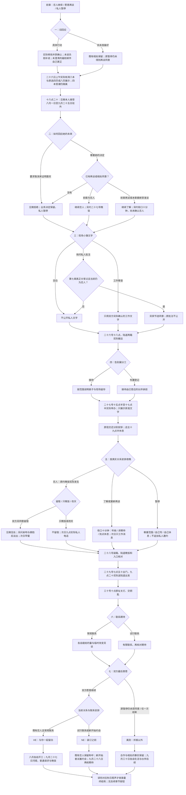

# 许见微线第十章《与你一起留白》分支结构

六月二十五日至三十日，八月及九月尾声。接续第九章的继续同行、愿意再谈或保留暂停。78 个对白场景、20 个回流节点，七次选择共 **2×2×3×2×3×2×2＝288 种组合**。正文与选项 **11,609 字符**，包含所有平行分支。

图中的夜晚分支都提供三个选项，按此前真实答复显示不同内容。暂停时的联系安排只是知夏自己的未发送记录，不能据此获得见面同意；最后选择接受或结束，不再次催问。

留宿、亲吻、公开节选、活动岗位与展示规模不决定恋爱结局。已谈妥的恋人选只晚饭或改天也能到 HE；此前暂停者本章具体回应后可重新开始约会，进入 NE，不自动变为女朋友。已有恋人选择试行联系也进入 NE，但保留恋人身份。

业务、工作和私人关系分别记录：见微本人接受驻外合作的事实保留在全部结局；原第七至九章标记不回填，今天的新回应另记。受潮隔离、原交印、到货与抽检、作者原信和影像权限保留。真正读完留宿、送站、关灯与秋日场景之后才写入对应完成标记。

最终结局：`xu_he`《与你一起留白》、`xu_ne`《装订之前》、`xu_farewell`《折痕以外》。本章使用独立章节标识 `xu10`，不改变林晚原第十章与存档编号。
