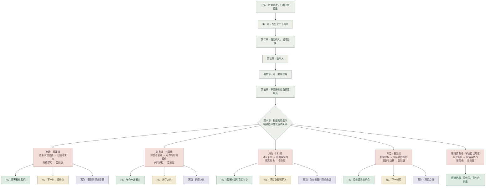
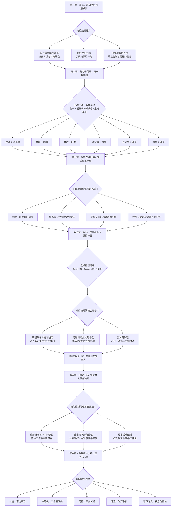
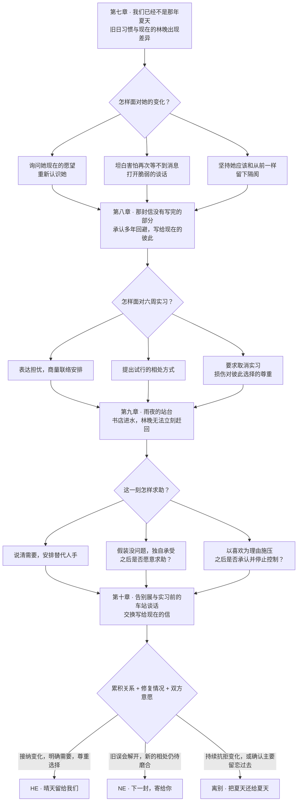
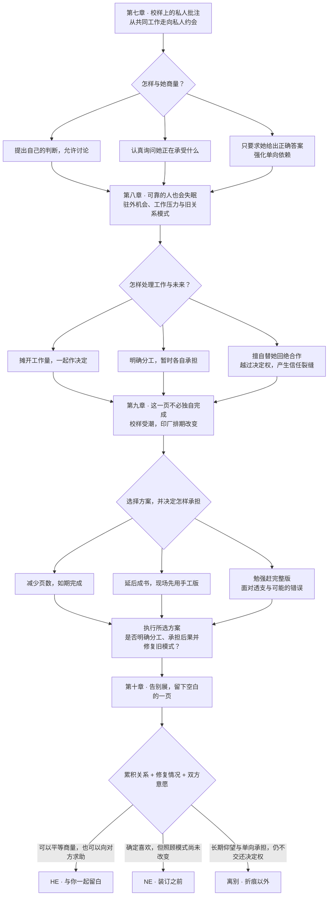
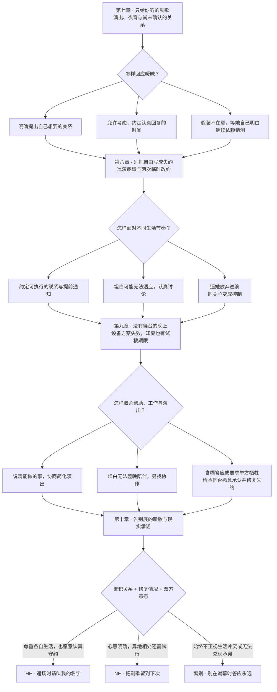
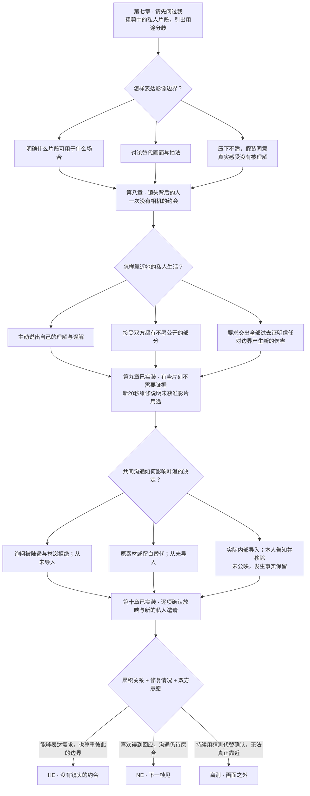

# 《雨停之前》故事分支树 v1

依据《故事大纲_v1.md》绘制。当前展示已确定的路线、关键事件和结局结构；约 50 处选择中的日常对白选项尚待详细剧本展开。

实施进度（2026-10-06）：共通六章及林晚、许见微、周栀三条完整路线已可玩；叶澄第七至十章与三个最终结局已可玩，独身群像收束篇《写给自己的信》也已接入，十三个最终结局全部可玩。本图保留早期整体规划，当前全部实际场景与条件见各章阅读版和分支树；最新为 [独身群像完整分支树](剧本/独身群像_分支结构.md)。

读图：箭头表示剧情推进；分叉表示玩家选择；箭头重新汇入同一节点，表示事件结束后回到共同剧情，但保留此前的关系变化、线索与约定。HE 为幸福结局，NE 为继续磨合的结局。「离别」与「独身」分别保留各自完整的收束。

## 1. 故事总树：五条路线，十三个结局

四条恋爱路线各为第七至十章。最终结局综合共通线相处、个人线的三次关键事件、后续修复与双方最终意愿形成；图中的三个结局不代表最后一题可以直接任选。

## 2. 共通线：六章中的关键分叉与回流

- 第二章选择两项，共六种组合；参加顺序可以改变对白，图中不重复展开。
- 第四章先确定参加哪项角色事件，再处理具体的日程冲突；其结果还会影响与陆遥的友情支线。
- 路线入口会提示尚未经历的重点事件。相处不足时可以回到分歧书签补看，不把玩家自动分配给最高好感角色。
- 小分支回到同一章后，仍保存人物知道的信息、是否守约、有没有完成关键谈话，以及可在暴雨夜获得的协作支持。

## 3. 林晚线：重新认识，而不只重温过去

## 4. 许见微线：把可靠变成可以互相依靠

第九章的三个制作方案会改变展览形式；关系结果还取决于怎样执行方案。减少页数或延后成书都能走向 HE。

## 5. 周栀线：喜欢之外，还要学会守约

第九章把大纲中的「是否接纳不完美版本、是否说清帮助范围」展开为示意选项，具体措辞待写正式场景。公开或私下表白均可进入 HE。

## 6. 叶澄线：从看见表情，到真正认识一个人

第九章包含角色自己的决定：玩家通过知夏的沟通参与，但不能直接代替叶澄作出所有行动。删除私人片段或不公开隐私都可以进入 HE。

## 7. 独身群像线：同样完整的夏天

已实装85个场景，七次选择384种组合，完整场景树见 [独身篇分支树](剧本/独身群像_分支结构.md)。原第六章独身存档可直接继续。

~~~mermaid
flowchart TD
 A[第六章独身方向：原独处信 / 原朋友晚饭] --> B[印厂原确认或今天新确认]
 B --> C{一：具体旧调整 / 仍未准备好}
 C --> D{二：原八点朋友谈话 / 真正核清今晚安静}
 D --> E[原谈话实谈或共同撤回；没有欠约者聊今天或各自安静]
 E --> F[到货抽三本；20号反馈实际发送]
 F --> G{三：林晚 / 见微 / 周栀 / 叶澄的普通半小时}
 G --> H[新询问、新答应、21号真实见过；各自原安排继续]
 H --> I[22号自己修订；23号店主自己的休息]
 I --> J[24号暴雨：停湿设备、四本隔离、48元仅报价]
 J --> K{四：有限求助 / 隐瞒做不完 / 要求大家都来证明友情}
 K --> L[获准的一项真实做完后离开]
 K --> M[初核未完成，记录欠项]
 K --> N[要求被拒，施压事实保留，20点30真撤回]
 L --> O[25号沿用实际复核]
 M --> P[25号新问陈序宁十分钟，实际补核]
 N --> P
 O --> Q[25号11点完整材料实交]
 P --> Q
 Q --> R{五：短节目及新卡片 / 更安静纸面与短读}
 R --> S[26号岗位本人接受、租房本人核签、新卡片用途本人分别同意]
 S --> T[26号两箱真实搬；原书册页数印数费用不改]
 T --> U{六：入口 / 归还桌}
 U --> V[27号14点至14点50真实岗位、纸面展与短读]
 V --> W[活动完成、物件卡还本人、店主按时休息]
 W --> X[28号实际装箱、18点晚饭、20点核入口]
 X --> Y[29号7点50出发、9点20原车次送别]
 Y --> Z[30号10点原址关灯交钥匙]
 Z --> AA[另外问6号十分钟朋友电话；16点新住处交接并实搬]
 AA --> AB{七：信不封口 / 真封好留给秋天}
 AB --> AC[7月1日实际入职；6号实际普通电话；8月朋友各自近况]
 AC --> AD[9月30日继续未封口的信 / 真拆六月封好的信]
 AD --> AE[真实秋日沿河，最后一句后收藏]
 AE --> AF[唯一独身最终结局：雨停后，我也向前走]
~~~

全部分支最终有各自完整的独身生活，两种活动与两种私信是同一个独身结局内的差分，不计为第十四个结局。旧欠回应事项按实际保留或回收，合作和友情不会自动发展成恋爱。

## 8. 后续落地时的分支记录

| 记录内容 | 从哪里积累 | 在哪里回收 |
| --- | --- | --- |
| 和谁经历过重点事件 | 共通线第二至四章 | 第六章路线入口、个人线回忆与主动邀约 |
| 谁知道旧信带来的感受 | 共通线第三章 | 后续私人谈话、林晚旧情的理解与解释 |
| 有没有说明缺席与兑现改期 | 共通线第四章及个人线 | 信任、友情修复、是否相信新的约定 |
| 筹备意见是否得到确认 | 共通线第五章 | 暴雨夜协作、活动规模与表现形式 |
| 怎样面对需要、差异与边界 | 各个人线第七至九章 | 冲突后的修复场景、三类恋爱结局 |
| 是否道歉并改变后续行动 | 误会或伤害后的场景 | 允许修复此前错误，避免一次失言锁死结局 |
| 双方最后愿意怎样相处 | 各路线第十章 | 与前面关系状态共同形成结局及秋日尾声 |

当前不设具体分数阈值。等完整场景与对白写出后，再确定关键标记和判定规则，保证图中的路线与可玩的剧本一致。
