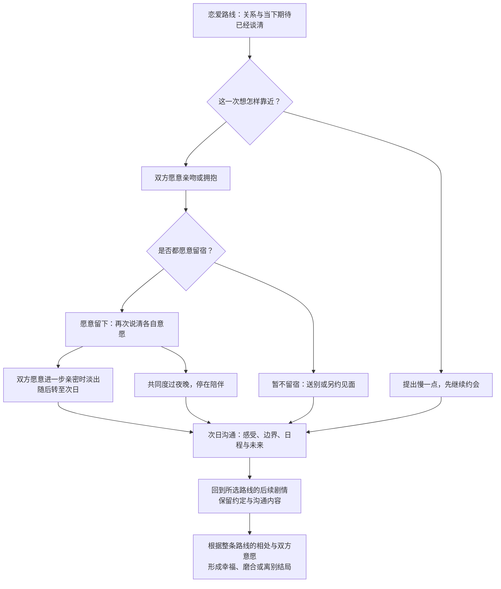

# 《雨停之前》长篇故事大纲 v2 · 成人恋爱版

本稿在 v1 的四条恋爱路线与独身群像路线基础上，加入成年伴侣的亲吻、留宿、亲密关系与后续沟通。私密过程使用淡出转场，正文聚焦人物感受和关系变化。此稿不含露骨性描写，也不代表已取得任何正式年龄分级。

实施进度（2026-10-06）：共通六章，以及林晚、许见微、周栀各四章与三种最终结局、秋日尾声已完成。周栀第十章《返场时请叫我的名字》已接入，四章实施场景表与路线树见 `剧本/周栀线_四章路线场景表.md`。叶澄第七至十章、三个最终结局与秋日尾声也已接入，独身群像收束篇《写给自己的信》也已接入，十三个最终结局全部可玩。第九章使用本章新获准的20秒维修说明片段，三个用途选择分别询问被拒、从未导入或实际越界导入后本人告知与移除；不复用知夏的旧私人十秒与共同照片。以下为总体故事规划，已实装时间和条件以对应阅读版、分支树为准。

## 一、故事定位

**类型：** 女性主角第一人称、成人百合恋爱、都市大学城、夏日群像。当前恋爱人物年龄分别为 22、26、23、23 岁，主角 22 岁。

**气质：** 温柔慢热，但有真正需要面对的冲突。心动来自相处中的具体动作，矛盾来自不同生活目标、沟通方式与边界。分开也可以是一种有尊严的选择。

**主题：** 曾经没有说出口的喜欢，可以重新开始；但现在的我们，不能只凭过去相爱。

**新增关系主题：** 承认对女性的喜欢，谈清关系中的期待与排他约定，决定何时亲近、是否留宿，以及在亲密之后继续处理工作、距离和生活差异。每条路线都让双方主动表达意愿。

**规模建议：** 总剧本约 8–12 万字。共通线 6 章，四条恋爱路线各 4 章，另有群像收束与结局尾声。单周目预计 2–4 小时，全部路线预计 8–12 小时；具体时长随最终字数和阅读速度调整。

**一句话梗概：** 大学毕业的六月，沈知夏在即将搬离老街的书店重逢了四年前暗恋的女孩。她与四位各怀心事的女性，决定在月底办一场「未寄出的信」展。筹备的三十天里，她们修复书页、整理告别，也逐渐分清自己究竟想留住一个地方、一段过去，还是一个真实站在眼前的人。

## 二、主线事件与世界

故事发生在虚构的临江市大学城，时间为 6 月 1 日至 6 月 30 日，结局另有秋日尾声。

「归雨书屋」是大学后街经营十余年的旧书店。租约月底到期，房东准备另作经营。店主林岚已经决定结束原址经营，休息一段时间，再考虑是否开一家更小的店。她舍不得这里，却也不希望所有人为了她牺牲自己的生活。

沈知夏提出，在搬走前做一本店史小册子。摄影师叶澄建议同时拍一部短纪录片，音乐人周栀答应办告别小演出，书籍设计师许见微负责装帧，林晚则负责整理库存与旧读者的来信。

她们最终把活动定为「未寄出的信」：征集读者愿意分享的书信，展出得到授权的片段，再留出一个可以当场写信、投递或自行带走的角落。

**贯穿全篇的目标是完成这场告别，而不是必须把原址救回来。** 活动能办得如何，取决于众人的合作与取舍。即使书店搬走，人与人的联系仍可能留下。

主要场景：旧书店、大学宿舍、屋顶天台、印刷工作室、小型音乐排练室、公交站、河堤与海边。每个空间承担不同的关系变化，不反复用一张桌子完成所有谈心。

## 三、主要人物

### 沈知夏｜22 岁｜玩家主角

中文系毕业生，最初计划九月在临江市出版社入职；周栀、叶澄与独身方向后来收到七月提前开始的新岗位提议，实际接受与到岗按本人答复发生。擅长整理别人的表达，却常常不肯说清自己的需求。习惯先给出一个「稳妥的答案」，再独自承担它的后果。

她四年前喜欢过林晚，没有坦白。林晚转学离开后，她把那段关系解释成自己想太多。重逢让她看见：她不是没有感情，而是害怕一旦认真选择，就不能再假装自己没有失去。

**主角成长：** 从替所有人安排一个好结局，到能说出「我想要什么」，也允许别人给出不同答案。

她在四条路线里不是同一个恋爱模板：对林晚容易怀旧，对许见微容易仰望，对周栀容易过度照顾，对叶澄容易把被关注误认成被理解。

**成人恋爱补充：** 知夏已经知道自己会喜欢女性，却一直把这种喜欢藏在「很特别的朋友」的说法里。她对亲密关系的顾虑，是害怕表达期待后被拒绝，或者答应得太快后失去选择空间。个人线让她学会说出愿意、尚未准备好，以及希望怎样继续相处。

### 林晚｜22 岁｜重逢线

粉棕色短发，喜欢桂花乌龙。林岚的外甥女，刚获得本地大学研究生录取，六月回来帮忙整理书店，暑期有六周的沿海生态调查实习。

四年前因家人工作调动而转学，临走前把告白信夹进两人约好借阅的诗集。她以为知夏已经读过，只是不愿回应；知夏却根本没有取走那本书。此后的沉默，是两个人都没有继续确认的结果。

两人并非因为失去联系方式而错过四年。最初仍会节日问候，却都把对方简短、客气的回复理解为不愿继续靠近；后来问候渐少，谁也不敢先询问那段关系。旧信解释的是最初的误会，她们还需要承认之后多年主动回避的责任。

她现在比从前更有主见，想做野外研究，也愿意面对家庭对职业选择的质疑。可面对知夏，她仍很容易退回「只要她高兴就好」的位置。

**关系命题：** 你喜欢的是四年前的她，还是已经改变的她？

**心动细节：** 会记住知夏翻书时总先看目录；重逢后仍给她留窗边座位，却开始认真提出自己想去的地方。

**新增亲密侧面：** 林晚也会主动发起牵手、约会与亲吻。她希望知夏回答的是现在的邀请；两人需要谈清楚亲近并不自动解决多年回避，也不代替对暑期安排的商量。

### 许见微｜26 岁｜并肩线

短黑发、细框眼镜，经营一间小型书籍设计工作室。她曾负责归雨书屋的活动海报，是林岚的老朋友。与知夏是平等的项目合作者，没有雇佣或考核关系。

外表冷静，讲话简短，工作到深夜也把桌面收得整整齐齐。她能准确发现别人的为难，却极少让别人知道自己正在承受什么。

曾与一位女性伴侣分手，原因之一是双方逐渐把「可靠」当作不需要关心的证明。她如今把工作排得很满，也把关系维持在安全的礼貌里。

**关系命题：** 亲密不是一方永远照顾另一方，而是允许彼此有做不到的时候。

**心动细节：** 记得知夏喜欢的纸张触感；在严谨的校样上留下一句只写给她的私人批注。

**新增亲密侧面：** 见微有过成年恋爱经历，会表达自己喜欢怎样被陪伴，但并不因此拥有所有答案。她需要练习向知夏提出私人请求；知夏也需要能够提出自己的节奏。年龄与经验差异会成为谈话内容，决定仍由两个人共同作出。

### 周栀｜23 岁｜同行线

深色长卷发，独立音乐人，在大学城附近演出。和陆遥认识，通过她加入告别活动。嘴上很会开玩笑，被认真夸奖时反而会躲开视线。

她刚结束一份不适合自己的商业音乐合作，正在准备自主制作的 EP。七月收到外地巡演邀请，却担心自己再次把所有关系弄成「等我有空再说」。

她的生活并非没有计划，只是收入和日程不稳定。她希望别人尊重自己的选择，不希望被当成需要拯救的人；同时，她也必须学会为迟到、失约与模糊承诺负责。

**关系命题：** 可以喜欢不同的生活节奏，但不能让「自由」替失约开脱，也不能让「关心」变成控制。

**心动细节：** 把知夏随口念的句子写进旋律；演出后在人群里先寻找她，却一直不敢问她是否愿意留下。

**新增亲密侧面：** 周栀容易表达吸引，也容易在认真谈关系时用玩笑躲开。个人线会让她明确说明自己的心意、排他约定与现实承诺，之后再决定是否共同过夜；知夏则要承认自己既喜欢她，也需要稳定的联络。

### 叶澄｜23 岁｜看见线

影像专业毕业生，爱穿轻便衬衫，随身带一台小摄像机。正在做「城市里将要消失的地方」毕业作品的后续拍摄，归雨书屋是其中一站。

敏锐、好奇，能捕捉别人自己都没有意识到的表情。她的问题是：有时候，她太相信镜头里的解释，以为看见一个人的眼泪，就已经理解了那个人。

母亲常年在外工作，使她习惯先记录，再等待。她想留下重要的人，却不擅长在没有相机遮挡的时候主动靠近。

**关系命题：** 让一个人被看见，也要让她有权决定哪些部分不被看见。

**心动细节：** 给知夏拍照前总会认真问一句；真正确定心意后，她第一次主动把相机留在家里赴约。

**新增亲密侧面：** 没有相机的约会里，叶澄需要自己提出牵手、亲吻或留下来的邀请。知夏也会主动回应，而不总等着被观察。她们会明确哪些共同生活可以记录，哪些时刻只属于彼此。

## 四、配角与人物关系

| 人物 | 身份 | 独立诉求 | 对主线的作用 |
| --- | --- | --- | --- |
| 林岚，43 岁 | 归雨书屋店主 | 结束透支自己的经营方式，拥有休息和重新选择的时间 | 制止大家把「不许关店」当作唯一正确答案；最终决定书店未来 |
| 陆遥，22 岁 | 知夏室友，即将去外地工作 | 好好告别大学生活，又不想所有情绪都由自己笑着带过 | 串联周栀，承担毕业搬宿舍支线；会直接指出知夏的回避 |
| 陈序宁，32 岁 | 社区图书馆活动负责人 | 把居民故事做成可以长期使用的公共资料 | 提供活动空间与归档渠道，要求征集内容获得授权；不代替众人解决资金和人际问题 |

关系不只围绕知夏展开：林晚与叶澄对「应不应该留下私人片段」有冲突；许见微与周栀对排期、预算和演出形式意见不同；陆遥与林晚都熟悉知夏，却各自认识她不同阶段的样子。

四位可恋爱角色彼此不会自动成为情敌。未进入恋爱路线的人仍有自己的选择、工作与友情。恋爱对象确定后，不继续以暧昧选项诱导多线承诺。

## 五、共通线：六章

### 第一章《百分之二十的雨》｜6 月 1–3 日

保留现有开场：知夏躲雨进入旧书店，与林晚重逢。喝茶、翻书，熟悉感很快出现，却被一句「月底以后，你就别来这里找我了」打断。

知夏先误以为林晚又要离开，随后得知书店原址即将停业。林岚说明自己的决定，知夏提出做一本小册子，记录这家店留下的故事。

陆遥来接知夏，把书店告别的消息发给周栀；叶澄恰好来确认拍摄；许见微带着旧海报登场。第一次群像碰面带一点尴尬，每个人都想帮忙，却对要做什么没有共识。

**关键分支：** 当晚留下来帮林晚整理书，跟叶澄去拍老街，或先回宿舍陪陆遥收拾毕业行李。会改变第二章开场、得到的线索和谁主动发来消息。

**章末钩子：** 知夏翻出那本诗集，看见信封上写着自己的名字。

### 第二章《借走的人，记得回来》｜6 月 4–6 日

林晚承认信是她写的，但请知夏等她准备好，再一起打开。两人第一次把四年前的误会说出一半，仍没有讨论今天的喜欢。

第一次筹备会上，知夏提出「未寄出的信」主题。许见微提醒她，好的想法也需要页数、经费和交付时间；周栀想把雨声写进告别曲；叶澄建议拍摄居民读信的画面。

四条关系分别出现第一段有辨识度的相处：和林晚修复书页；跟许见微去看纸样；听周栀试唱；陪叶澄走访书店老读者。

**关键分支：** 同一天下午只能参加两项活动。选择会改变被知夏了解的人，也会留下「没有到场」的后续回应。缺席不会凭空被判成冷漠，可以提前说明并另约时间。

**章末钩子：** 一位老读者送来十年前写给女性爱人的信，并说：「这次，我想让她知道是我写的。」

### 第三章《收件人》｜6 月 7–10 日

征集开始。几封不同年代的信形成镜像：有人告白，有人道歉，有人写给已经分开的恋人。信不是万能答案，寄出以后也可能得不到回应。

林晚准备好，主动邀请知夏一起读信。保留原短篇「想去看海，不是因为喜欢海」的句子。她随即明确：这封信说明过去的心意，不是要求知夏在今天偿还一个答案。

叶澄在读信后先询问知夏是否想留十秒翻书的手与侧影，不拍私人信件；知夏可选择不录、只留给自己，或先讨论暂不录。此前的拍摄约定不会自动扩大。许见微发现知夏答应了过多修改工作。周栀的一次迟到，让大家第一次谈到合作中的承诺。

**关键分支：** 知夏向谁说出自己读信后的真实感受？不同对象会给出不同理解；林晚线得到一次直面旧情的谈话，其他线则会开始区分怀念与当下的心动。私人信件不授权公开也不会扣恋爱进度。

**章末钩子：** 知夏收到入职前试稿任务，交稿日期恰好与小册子的第一轮校样重合。

### 第四章《同一把伞以外》｜6 月 11–14 日

关系从任务进入日常。大学的毕业典礼、宿舍清空、第一次试稿与活动筹备同时发生，知夏发现无法再把所有人的邀约都排进同一天。

四个可选重点事件：林晚邀她去确认沿海实习的行程；许见微需要一位可以商量校样的人；周栀邀请她参加只有十几位观众的小演出；叶澄请她陪自己看一场没有拍摄任务的电影。

陆遥在搬宿舍时终于生气：知夏一直说「等我忙完」，却没有认真问过她什么时候走。室友情成为第一场不能用恋爱选项代替的关系修复。

**关键分支：** 两个时间冲突的邀请如何处理？明确取舍、约定补偿、尝试两头赶，会产生不同的完整场景。故意隐瞒与合理拒绝得到不同后果。

**章末钩子：** 知夏发现，自己最想收到的那条消息，已经不只是筹备群里的通知。

### 第五章《不是所有空白都要填满》｜6 月 15–17 日

筹备第一次严重受阻：征集内容比预期多，预算只能支持较薄的小册子。有人想删去不完整、没有结果的信，有人希望保留那些无法被归纳成美好故事的片段。

知夏在疲惫中，把「大家都觉得可以」说成了一项已经通过的决定，导致被省略意见的人受伤。玩家选择影响她具体忽略了谁、谁会来提醒她，但这次沟通失误是主角必须面对的事件。

林岚公开自己的打算：她不接受以透支和自我牺牲为代价的「救店」。这个提醒也落在几段关系上——感情不是谁多承受一些就能永远成立。

**关键分支：** 对筹备分歧，是重新请每个人明确表态，独自接下所有修改，还是暂时缩小活动规模？这会改变最终展览的形式、合作信任和危机时可调用的帮助。

**章末钩子：** 夜里，知夏主动发出一条不为工作的消息：「明天有空吗？我想和你单独走走。」

### 第六章《我想见的是你》｜6 月 18 日

一天中的四段可能邀约，只进入玩家选定的一段：窗边谈话、工作室晚餐、天台试听、沿河散步。每段都会把关系推到「愿不愿意认真认识彼此」的位置。

玩家明确选择希望发展的关系。进入一条路线后，该对象会回应知夏的邀约；她们可能确定在约会，也可能约定慢慢靠近，具体取决于之前相处，不会一夜之间无条件深情。

**新增谈话：** 知夏可以直接说「我是以约会的意思邀请你」，也可以坦白仍想多认识对方。回应会区分试着约会、确认恋爱关系与暂时保持朋友身份；后续亲密场景根据双方已经说清的关系安排。

**路线入口：** 林晚、许见微、周栀、叶澄，或「暂时不开始恋爱」。若某人此前相处不足，界面提前说明尚缺的重点事件，可回到分歧书签补看；不靠隐藏的最高好感自动替玩家选人。

**章末：** 共通线到此结束。告别展仍在推进，路线主角开始参与知夏更私人、更具体的生活。

## 六、林晚线：从重逢到重新认识

### 第七章《我们已经不是那年夏天》

两人开始约会，知夏下意识安排从前喜欢的路线、点从前喜欢的东西，才发现林晚有些习惯早已改变。她以为林晚会留下帮忙到最后，却忽略了已经确定的沿海实习。

争执不是「你怎么变了」，而是林晚说：「你问我想不想和你在一起，但你没有问过我想过什么样的生活。」

**分支一：** 重新问她现在想要什么，坦白自己怕再一次等不到消息，或用「你以前不是这样的」回避变化。前两者开启不同的修复场景；最后一种会留下真正的隔阂。

**新增场景《这次可以靠近吗》：** 在愿意重新认识彼此的分支里，林晚主动邀请知夏散步，直接询问她是否愿意接吻。玩家可以回应、选择先牵手，或说明想慢一点；后两种会得到另一段完整谈话。若本章的隔阂尚未处理，场景转为谈清分歧，不强行推进亲近。

### 第八章《那封信没有写完的部分》

林晚讲出当年离开后的生活，并承认自己也该主动确认信有没有送达。知夏承认自己曾把「不去打扰」当作不承担被拒绝的风险。

她们试着写第二封信，写给现在的对方。信里不能只说「一直喜欢」，还要说第一次约会时不舒服的地方，以及对未来的真实期望。

**分支二：** 把担心说出来并商量异地联系，先提出试行的相处方式，或要求林晚取消实习。最后一种不会被描写成爱得更深，林晚也不会默默放弃自己。

**新增场景《写完信以后》：** 6 月 22 日，两人交换写给现在的信，谈清楚正在建立的恋爱关系。林晚邀请知夏留宿。她们可以选择共同度过夜晚、仅陪伴一会儿，或各自回去；双方愿意进一步亲密时，在意愿确认后淡出，转至次日早餐。林晚没有因为这次留宿答应放弃实习，知夏也不再把留宿当作以后绝不会分开的保证。

**次日回收：** 两人谈起昨晚是否自在、各自喜欢的相处节奏，以及出发以后怎样联系。没有留宿的分支用早晨的一通电话或约好的早餐承接，同样能进入幸福结局。

### 第九章《雨夜的站台》

6 月 24 日暴雨，一扇未及时修好的窗进水，部分展览信件与校样受潮。林晚在赶实习说明会的路上，收到知夏求助。

危机既考验她们如何协作，也考验知夏能否接受林晚有无法立刻到场的理由。其他伙伴可以帮忙，不让一段恋爱承担所有救援义务。

**分支三：** 明确说明所需帮助并安排替代人手，假装没有问题后独自崩溃，或用「如果喜欢我就回来」施压。事情都会推进，但关系的裂缝和修复机会不同。

### 第十章《晴天留给我们》

展览当天，两人各自保留第八章交换的、写给现在的信，选择把一段共同写下的展览寄语留给书店。随后去车站，谈清楚这段实习期间怎样保持联系。

**新增尾声细节：** HE 中，秋天的重逢延续了夏天谈好的生活方式。NE 中，两人愿意继续交往，但不以已经有过亲密关系为理由加速承诺。离别结局里，她们承认曾经的靠近是真实的，也允许现在的选择发生改变。

**HE「晴天留给我们」：** 承认变化、表达需要，并尊重彼此选择。秋天，林晚完成实习回到学校，知夏正式入职。她们拥有可执行的日常安排，也能坦然修改它。

**NE「下一封，寄给你」：** 旧误会解开，新的相处仍未磨合。两人决定继续约会，暂不承诺永远，用真实的联系代替等待对方猜测。

**离别结局「把夏天还给夏天」：** 知夏无法接受改变，或两人确认自己主要留恋过去。她们认真告别，旧信得到回答，却不成为一份必须履行的恋爱契约。

## 七、许见微线：从仰望到并肩

### 第七章《校样上的私人批注》

知夏和见微加班校样，发现她会在看似严肃的工作里藏很小的玩笑。第一次约会发生在一间开到很晚的面馆，见微主动谈起自己喜欢女人，也提到过去的关系。

知夏倾慕她的可靠，开始把工作与生活难题都交给她判断。见微则因为被需要，迟迟不肯说自己忙不过来。

**分支一：** 提出自己的判断并允许讨论，认真询问她的负担，或只要求她给出正确答案。不同选择决定约会是逐渐平等，还是变成一个人的指导课。

**新增场景《下班以后》：** 两人结束校样工作，明确接下来的时间是私人约会。见微说出自己也想牵手，而不是一直保持「等你准备好」的从容。知夏可主动回应，或提出先从约会开始。见微对自己的过去与期待给出真实回答，不用年龄替对方作决定。

### 第八章《可靠的人也会失眠》

见微同时接到一个需要长期驻外的合作机会。她为小册子延后回复，却告诉知夏「没什么要紧的」。知夏偶然看到她熬夜修改的文件，意识到所谓从容是付出了代价的。

两人争执后，见微说出曾经的关系如何走向疲惫。知夏也必须承认：自己用「听你的」逃避选择，而见微用「我来处理」逃避被拒绝。

**分支二：** 把工作量与决定一起摊开，暂时分开承担各自部分，或擅自替她回绝合作。前两种可以形成不同但健康的安排；越过她的决定权会严重损伤信任。

**新增关系谈话：** 见微主动问知夏是否觉得自己需要迎合她；知夏则指出见微经常省略真正想要的东西。两人讨论的是怎样成为恋人，而不是怎样继续做一个更合格的照顾者与被照顾者。若越过决定权的冲突仍在，她们先暂停约会，留出实际改变的时间。

### 第九章《这一页不必独自完成》

暴雨损坏部分校样，合作印厂无法按原排期补印。见微本能地接下所有善后，却第一次在电话里停顿，向知夏说：「我需要你帮我做一个决定。」

玩家面对真实取舍：减少页数如期完成、延后实体成书先做现场手工版，或透支两人的时间勉强赶出完整版。不同方案改变展览道具和尾声，不把更豪华的成品等同于更深的爱情。

**分支三：** 知夏是否能与她明确分工、承担自己提出的方案，并在出错后一起负责？

### 第十章《与你一起留白》

她们在最后一份校样上，留出一页真正的空白。它不是漏印，而是允许未来仍有未定的部分。

**新增场景《你也可以请我留下》：** 暴雨善后完成、原有矛盾得到处理后，见微邀请知夏到家里吃饭，并坦白希望她多留一会儿。玩家可以留宿、只吃晚餐，或提出改天再约。双方愿意进一步亲密时淡出，次日以两人第一次一起准备早餐承接。见微会直接提出需要帮助的地方，知夏也说清当天自己的安排。

**HE「与你一起留白」：** 两人以平等伴侣的身份讨论驻外工作与见面安排。秋日尾声，见微向知夏提出一个小请求，知夏不再惊讶于她也会需要帮助。

**NE「装订之前」：** 确认喜欢，却发现长期照顾模式还难以改掉。两人放慢关系，不把共同工作当作已经学会相爱的证明。

**离别结局「折痕以外」：** 知夏持续仰望，见微持续替她承担，或双方不愿交还决定权。她们结束恋爱，但把小册子完成；专业合作不会被分手抹去。

## 八、周栀线：从热烈到守约

### 第七章《只给你听的副歌》

周栀带知夏去看排练、便利店夜宵和演出撤场。知夏第一次发现，舞台上的自由背后有细碎而辛苦的工作。

周栀把写给她的旋律放在最后一首歌里，却在她问「我们现在算什么」时笑着绕开。她们需要把暧昧与正式关系区分开来。

**分支一：** 明确提出自己想要的关系，允许对方考虑但约定回复时间，或假装毫不在意后要求对方自己明白。前两种保留不同节奏；后一种让热烈越来越依赖猜测。

**新增场景《散场之后，认真回答》：** 演出后两人单独散步，周栀停止用歌词代替答复，明确说出想与知夏交往。彼此都愿意时出现第一次亲吻；若尚未谈清关系，则停在约好下一次见面。亲吻后仍保留关于关系定义的完整对话。

### 第八章《别把自由写成失约》

周栀收到七月巡演邀请。她想去，也想和知夏继续，却连着两次临时改约。知夏把担忧积攒到爆发，直接替她规划一条「更稳定」的职业道路。

两人都需要认错：周栀不能把梦想用作失约的理由，知夏不能把自己的生活方式当作唯一成熟的答案。

**分支二：** 商量可执行的联络与提前通知规则，坦白彼此可能无法适应，或用排他的要求逼她放弃巡演。尊重不是没有要求，提出要求也不等于阻止梦想。

**新增关系谈话：** 两人说清哪些演出互动属于工作、哪些私人约会需要提前告知，以及是否都希望建立排他的伴侣关系。周栀承认模糊说法曾让知夏不安；知夏承认自己也曾把所有热情都理解成一个必须兑现的长期承诺。

### 第九章《没有舞台的晚上》

暴雨使告别演出的设备方案无法实施。周栀可以取消演出，或改成小型不插电演奏；知夏则有自己必须按时提交的试稿，无法整晚帮她。

**分支三：** 是否愿意接纳一个不够漂亮但诚实的版本？双方能否提前说清自己能提供的帮助？剧情不奖励知夏放弃自己的工作去证明爱。

### 第十章《返场时请叫我的名字》

告别活动严格沿用雨夜确认的十五分钟、八分钟或取消音乐方案；演奏只使用已确认公开曲目，取消者不补唱。双方可另问只在新现场卡留两句文字，私人收件人和原副歌不录、不公开。完整私人副歌只在获准留宿后私下听，留白也能得到完整恋爱结局。

**新增场景《明早还要认真回答》：** 告别展结束、巡演出发前，她们安排一次不夹杂演出任务的晚餐。关系与联系约定已经明确时，周栀可以邀请知夏留宿；双方愿意进一步亲密后淡出至第二天。次日仍要处理车票、交稿与下次见面的时间。玩家也可以选择回家或只留下聊天，得到同样完整的后续承诺场景。

**HE「返场时请叫我的名字」：** 周栀如期去巡演，知夏开始自己的工作。她们学会联系、守约，也学会在计划变动前认真告知对方。秋日重逢发生在一场普通的下班约会。

**NE「把副歌留到下次」：** 感情明确，但尚不确定能否适应长期分隔。她们约定一段试行时间，承诺认真回答，不承诺必然成功。

**离别结局「别在谢幕时答应永远」：** 两人始终不肯正视生活方式的冲突。告别曲仍然完成，但知夏不再把演出中的一句话当成现实里的承诺。

## 九、叶澄线：从观察到靠近

### 第七章《请先问过我》

已实装版本：知夏在候选粗剪里看见尚未拍摄的灰色占位和“终于愿意留下”的拟用解释字幕，感到自己的私人情绪被预先写成作品需要的答案。第三章的私人十秒已交知夏并删除相机原件，仅给本人、不用于展览；本章不恢复副本、不导回、不重演读信。未录或只谈构图的路径也不凭空出现人物影像。冲突从新分镜提案开始，实际拍摄与用途须另问；未获准提案与字幕撤下。

叶澄以为这段真实的反应能够让作品成立，知夏却感到自己被解释了。冲突发生在具体的授权边界上，而不是把叶澄简单写成偷拍者。

**分支一：** 明确哪些片段可以用于什么场合，主动讨论替代拍法，或压下不适假装同意。删除私人片段不降低亲密进度，也不必导致作品失败。

### 第八章《镜头背后的人》

两人安排一次没有相机的约会。叶澄第一次不知道该用什么打开话题，知夏第一次看见她的紧张。

叶澄讲起等待母亲回家的经验，承认自己擅长留下图像，却不擅长向图像里的人要求陪伴。知夏意识到，自己也在用「被她拍得很好看」回避真实沟通。

**分支二：** 主动表达自己的理解与误解，接受各自有不愿讲的部分，或要求她把一切过去都交出来证明信任。亲密可以有边界，并不要求全面公开。

**新增场景《今天不拍》：** 在一次双方都知道不会拍摄的约会里，叶澄主动表达喜欢，请知夏回应自己的邀请。玩家可以接吻、先拥抱，或说出尚未准备好的部分。她们随后谈到关于留宿的期待；愿意留下的分支，在进一步亲密前淡出，次日由一顿普通的早餐延续情绪。

**次日回收：** 两人确认哪些事可以向朋友分享，哪些共同照片可以留下，以及有哪些感受需要再谈。选择不留宿时，叶澄认真送知夏回家，约定下次见面的时间。两种分支都让她们练习在镜头以外发出邀请和回应。

### 第九章《有些片刻不需要证据》

暴雨夜，四本册子受潮隔离，设备停用。叶澄另问并获准拍一段二十秒维修说明：窗框、陆遥手部和现场说明声音，只供现场参与者与维修人员核对。陆遥对新住处的害怕恰好留在说明声音里，这段适合作结尾的情绪并未获得影片用途许可；它与知夏旧私人十秒、昨天共同照片无关。

**已实装六次选择：** 实际回应旧事或保留现状；询问影片用途、原素材替代或先放内部候选；有限帮助或自己的工作；真实回应、辩护或暂缓；双方继续或暂停；依关系另问今晚的牵手、谈话或休息。63个场景、9,822字符、216种组合。知夏的建议参与讨论，叶澄亲自作出使用判断并对自己的行动负责。

询问路径得到陆遥和林岚明确拒绝，始终未导入影片；替代路径不扩大用途，也未导入。越界路径真实导入内部候选并播放一次，未发送或公映；叶澄本人告知两位当事人并移除素材与缓存，收到移除结果不等于原谅，后来删除不改写已经发生的事实。次日依当事人要求删除叶澄自己的维修副本，不声称所有人持有的副本都已消失。

内部候选可以把留白当作一部分：使用原获准环境、物件或切黑，私人情绪不用。原恋人、约会与了解分别保留；原暂停修复后仅愿意再谈，不自动成为恋人。次日原工作核对与知夏完整材料实际提交，公开放映仍待确认。叶澄收到七月八日至八月四日四周项目询问，六月二十六日17点本人答复，目前尚未接受或出发。

### 第十章《没有镜头的约会》

已实装83个场景、24个回流节点、13,722个正文与选项字符，七次选择288种组合。二十六号另问并实际拍新空场环境，或采用叶澄自己的物件静音分镜，两版均仅二十七号15点10至14现场一次；旧私人十秒、共同照片与维修片段不用，不准网上发布。新干燥投影设备真实核试播与归还，原湿设备仍停用，四本隔离与48元报价未下单保留。

真实回应旧事、具体联系或有限试行后，原恋人另问晚饭、住处与留宿；其他方向只新十五分钟谈话，原暂停修复者尚未恢复约会。未回应或坚持控制职业与全部素材者没有私人邀请。影片、岗位、帮助量和不留宿都不决定恋爱答复，已发生的靠近也不会因后来告别被抹去。

陆遥两箱搬运、二十八号装箱与晚饭及入口核对、二十九号7点50出门与9点20原车次、三十号10点关灯交钥匙全部真实兑现。三十号11点电话双方实际约定，之后告别则真正共同撤回；没有答应过的电话不补取消。继续者七月十号实际通话，稳定方向十七号提前150分钟通知，共同改到21点至21点20并实打。

叶澄本人二十六号16点30接受七月八日至八月四日四周影像助理项目，8000元报酬不预记结清，交通住宿由项目方承担；七月八日真正到场、八月四日真正完成。知夏本人接受岗位，七月一日9点实际报到，下班后的住处回收这一天。各自职业不因私人结束而取消。

**新增尾声细节：** 她们如何处理第八章约好的私密边界，会在暴雨夜与放映后的关系谈话里回收。HE 中，双方能谈及自己的期待；NE 中，她们继续摸索相处方式；离别结局中，曾经愿意靠近不被解释为对之后所有记录和行动的许可。

**HE「没有镜头的约会」：** 原女朋友、具体旧事回应、职业自主与稳定联系、双方继续。秋日下班时真实赴约，不带相机，牵手另问，先一起生活，之后是否记录仍再决定。本章没有新增共同照片。

**NE「下一帧见」：** 符合继续条件且双方愿意，但仍有限试行或继续原约会、了解后新开始。原女朋友保留称呼，原约会不重起算，新约会三十号11点20双方答应才开始；秋日不自动升级恋人。

**离别结局「画面之外」：** 原回应未完成、坚持控制决定权或本人选择结束，私人发展告别。作品、活动与各自职业完成，旧相处真实保留，秋日自己下班和友情继续。三个最终结局均在各自秋日最后一句读完后才收藏。

## 十、独身群像路线《写给自己的信》

已实装独立收束篇，直接承接第六章主动暂不恋爱的方向。85个场景、14个回流节点、15,020正文与选项字符，七次选择384种组合。完整正文和实际条件见 [阅读版](剧本/独身群像_写给自己的信.md) 与 [分支树](剧本/独身群像_分支结构.md)。

知夏继续原独处时十八日未封口的信，或从十九日新写的纸开始。合作欠项选择真实回应或明确保留；陆遥原十九日二十点谈话选择真正赴约或双方明确撤回，当日饭局、帮搬箱子与新的普通电话不擦除旧未完成事项。

她二十日新问二十一日十五点的普通朋友半小时，林晚的借阅卡、见微的折纸、周栀的午饭、叶澄路边的树各有独立完整场景，不转换成约会。自己的反馈、修订与二十五日十一点完整材料实际交出。

二十四日暴雨中停用湿设备、隔离四本册子。可以向那位朋友新问一项有限协助，可以怕麻烦而隐瞒做不完的量，也可能要求全部朋友回来证明友情；后者受到本人拒绝，实际撤回后仍保留发生过的事实，不替大家宣布原谅。未复核完成者二十五日另问陈序宁十分钟，真正补核。四十八元仅报价，原印数页数与预算保持。

告别展选择短节目及新卡片，或更安静的纸面与短读。新文字、物件画的用途分别取得本人新同意，只在二十七日现场一次，不挪用私信、旧影像或私人旋律。入口与归还桌两种五十分钟岗位实际交接，活动完成，新卡片归还，店主按时休息。

二十六日两箱搬运、二十八日装箱与晚饭、二十九日九点二十原车次送站，三十日十点原址关灯交钥匙都真正发生。知夏本人二十六日接受编辑岗位、核签租约，三十日十六点房间交接并搬入，七月一日九点真正到岗。

自己的信选择不封口继续写，或三十日真封好留给九月三十日再拆，始终私存。七月六日与陆遥原十分钟普通电话真实打过，夏天收到所选伙伴的近况，秋天在新桌边读自己的信，再去河边走一段。

唯一最终结局《雨停后，我也向前走》在秋日最后一句后收藏。独身是一种完整选择，未完成的事可照实保留，工作、友情与自己的新生活不需要靠恋爱答复成立。

## 十一、分支结构与结局原则

计划约 50 处选择，其中约 18 处决定后续重要场景或关系走向，其余影响相处细节、称呼、私人对话和尾声。现已实装共通线六章、四条恋爱路线各四章与独身收束篇，共23个章节条目。

结构：

共通线六章 → 玩家明确选择恋爱对象或独身 → 恋爱路线各四章 / 独身完整收束篇 → 对应结局与秋日尾声。

四条恋爱路线各有 HE、NE、离别结局，加上独身群像结局，**总计 13 个主要结局**。不同活动方案、私人细节与展览形式，再提供结局内部的小变化。

### 三种不同层级的选择

| 层级 | 例子 | 后果 |
| --- | --- | --- |
| 日常选择 | 喝什么茶、谁先撑伞、选哪种纸 | 更改对白、回忆和之后的呼应，不把偏好判成对错 |
| 事件选择 | 今天参加哪项活动、与谁谈读信的感受 | 打开或错过完整支线，改变谁知道某件事、谁会主动联系 |
| 关系选择 | 怎样处理失约、是否承认自己的需要、是否越过对方的决定权 | 改变冲突处理、修复机会及结局 |

关系发展需要看「信任」「理解」「表达」以及具体的关键事件，不能只用一条累计好感决定全部结果。不同人需要的理解不同，勇敢也不总等于说得更多。

**v2 新增选择：** 四条路线各增加一次亲吻或拥抱的节奏选择、一次留宿与否的选择，以及一次事后沟通，共约 12 处，总选择数量调整为约 60 处。是否进入私密转场由双方当时的意愿决定；结局判定仍依据理解、守约、沟通与最终意愿。选择慢一点、暂不留宿或中途改变想法，均可进入 HE。

**重要约束：**

- 一句口误不会直接毁掉整个周目。严重的误解有后续澄清或道歉场景，但道歉需要改变后面的行为。
- 结局由数次真实互动和最后双方的明确选择共同形成，不让最终一题覆盖此前所有矛盾。
- 选择沉默有时是尊重、有时是回避，要结合情境，不把某个措辞固定当成正确答案。
- 不以公开恋情、牺牲职业或交出全部隐私作为 HE 必要条件。
- 积极的展览结果不自动等于恋爱成功，恋爱失败也不自动让活动崩盘。
- 路线锁定后，其他角色继续参与群像事件，但结束恋爱暗示；如果需要改变对象，回到分歧处重选。
- 四条路线都是独立成立的故事，不设置某一位才是「真正官配」的全线隐藏结局。

## 十二、伏笔与回收

| 伏笔 | 初次出现 | 主要回收 |
| --- | --- | --- |
| 诗集扉页「借走的人，记得回来」 | 第一章 | 林晚线改成「回来以后，也可以重新认识」 |
| 展览小册子的空白页 | 第二章 | 许见微线将未定的未来作为主动保留，而非失败 |
| 周栀没有歌词的副歌 | 第二章 | 周栀线完成歌词，也必须给现实中的约定一个答案 |
| 叶澄总让别人站到镜头前 | 第一至三章 | 叶澄线自己走进关系里，允许重要片刻没有拍摄 |
| 陆遥贴在宿舍门上的搬家日期 | 第四章 | 知夏能否主动记住朋友的离开，不再只回应恋爱对象 |
| 林岚常把收店时间往后推 | 第一章 | 第五章说出疲惫，结尾终于准时关灯 |
| 第一章只有一个窗边座位 | 第一章 | 尾声根据关系出现第二把椅子，或成为知夏自己的阅读角 |

## 十三、关键场面与后续写作顺序

应优先写出有独特动作与情绪变化的场面：雨中重逢；第一次五人筹备；经当事人同意打开旧信；知夏与陆遥搬空宿舍；路线锁定的单独邀约；暴雨夜修复受潮书页；告别展；最后一次在原址关灯；秋日普通生活里的重逢或告别。

甜的部分放在这些动作里：一起修书时擦到指尖、被认真记住的口味、只留给一个人的批注、耳机里先听到的半首歌、拍照前的一句询问。冲突则必须写清楚各自为什么这样做，不能只靠突然不回消息延长剧情。

正式扩写顺序建议：先完成六章共通线详细场景表，再写林晚线验证原故事的延展，之后写许见微、周栀、叶澄三线，最后核对群像线与十三个结局。每个场景明确时间、出场人物、关系变化、关键选择和分支回流位置。

本稿确定后，再写详细章节与对话，之后才替换游戏剧本与分支系统。

## 十四、新增亲密场景与分支回收

| 路线 | 第一次明确靠近 | 可选留宿场景 | 场景之后需要继续处理的问题 |
| --- | --- | --- | --- |
| 林晚 | 第七章《这次可以靠近吗》 | 第八章《写完信以后》 | 现在的彼此与旧日印象、六周实习、真实需求 |
| 许见微 | 第七章《下班以后》 | 第十章《你也可以请我留下》 | 经验差异、共同承担、主动表达需要 |
| 周栀 | 第七章《散场之后，认真回答》 | 第十章《明早还要认真回答》 | 关系定义、巡演、联络与守约 |
| 叶澄 | 第八章《今天不拍》 | 第八章约会后段 | 私人边界、记录范围、没有相机时的交流 |

新增场景以现在的成年关系为背景。四年前的回忆承载告白与误会，私密场景均发生在当前时间线。

通用回流结构：

私密转场后的场景仍有实际叙事任务：主动表达不自在之处、确认需要保留的隐私、提出下一次约会、面对当天的工作，以及检验此前的承诺有没有兑现。后续争执会把这些谈话重新带回来。

若出现尚未处理的控制、越界或持续失约，先写清冲突与行为上的修复，再考虑恢复约会。独身群像线继续围绕友情、毕业与自我选择推进。
